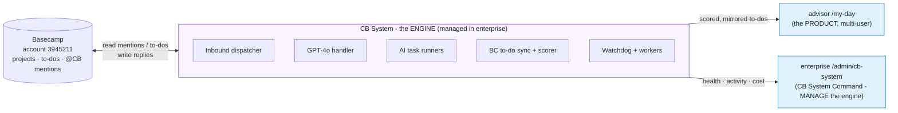
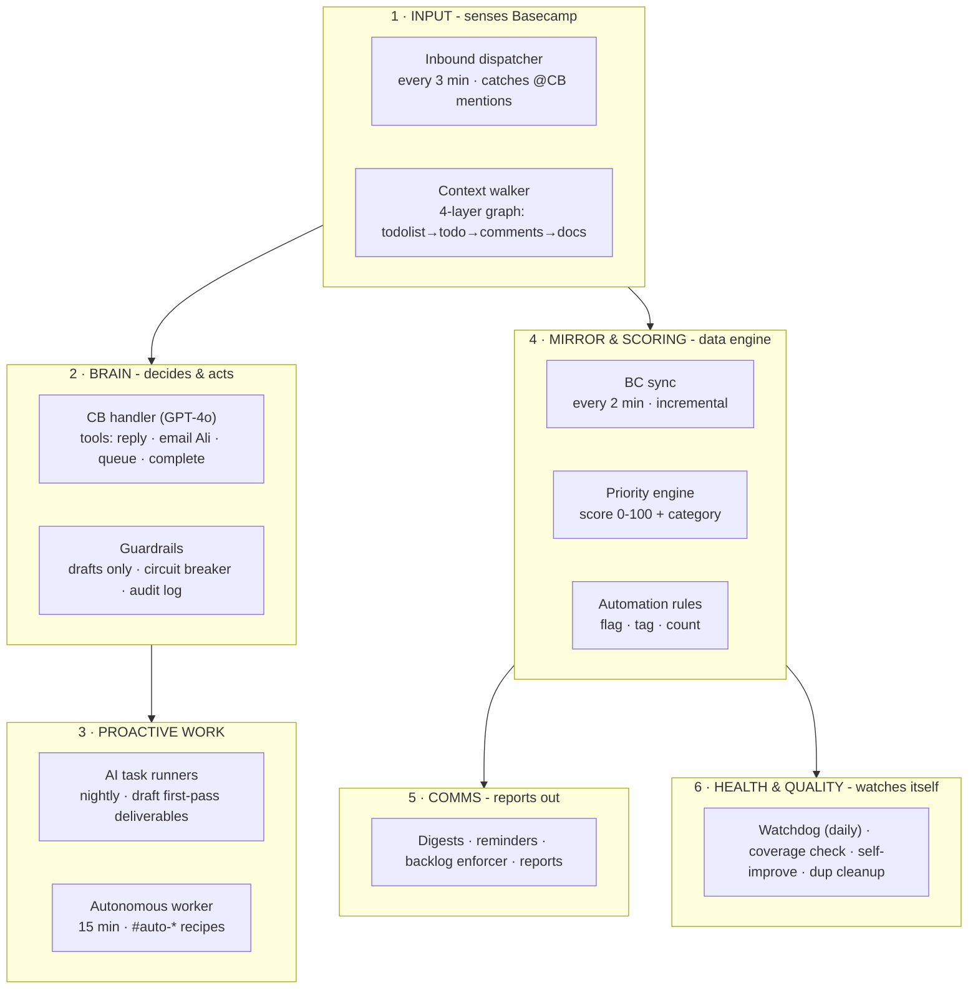
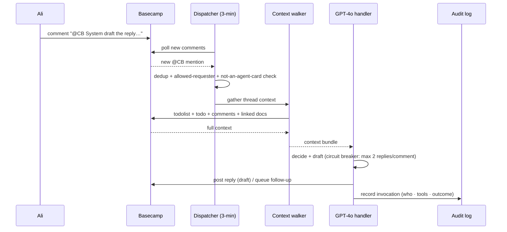
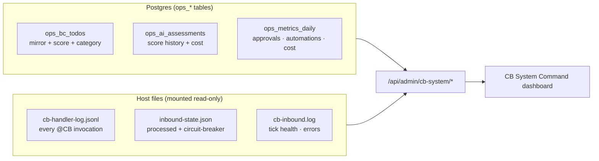
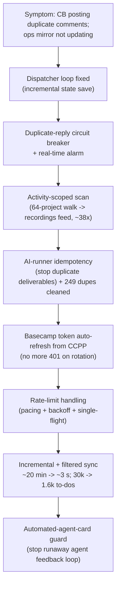

# CB System - Architecture & Management Report

*Colaberry · Internal Systems · prepared for Ali Muwwakkil*

CB System is the **autonomous agent that lives inside Basecamp**. It reads
@-mentions, drafts deliverables, scores and tracks to-dos, watches itself, and
reports to you. It is the **engine** that the advisor app's `/my-day` product is
built on - it is what connects the two projects.

This report explains every moving part, how the pieces connect, what data each
produces, and how you manage it from the new **CB System Command** dashboard
(`enterprise.colaberry.ai/admin/cb-system`).

---

## 1. The big picture - engine vs. product

**Key point:** `/my-day` (advisor) is the product; CB System (enterprise) is the
shared engine. The enterprise "Run My Day" page was a duplicate of `/my-day` and
has been **retired** - replaced by **CB System Command**, which *manages the
engine* rather than re-implementing the product.

---

## 2. The moving parts, by layer

| Layer | Component | What it does | Cadence |
|---|---|---|---|
| Input | **Inbound dispatcher** | Catches @CB mentions across all projects, dedups, routes | every 3 min |
| Input | **Context walker** | Pulls full context (todolist, todo, comments, linked docs/PDFs) | on demand |
| Brain | **CB handler (GPT-4o)** | Interprets the request, calls tools (reply / email / queue / complete) | per mention |
| Brain | **Guardrails** | Drafts-only, duplicate-reply circuit breaker, JSONL audit log | always |
| Work | **AI task runners** | Auto-draft first-pass deliverables for upcoming AI-tier to-dos | nightly |
| Work | **Autonomous worker** | Runs `#auto-grep / #auto-sql / #auto-comment` recipe to-dos | every 15 min |
| Data | **BC sync** | Mirrors Basecamp to-dos into Postgres (incremental, ~2 s) | every 2 min |
| Data | **Priority engine** | Scores every to-do 0-100 + category (human-required / waiting / unscored) | every 2 min |
| Data | **Automation rules** | Deterministic actions: flag-for-archive, tag-category, count metrics | every 2 min |
| Comms | **Digests / reminders / backlog enforcer / reports** | Email summaries + nudges | scheduled |
| Health | **Watchdog / coverage check / self-improve / dup cleanup** | Detects anomalies, fixes weak answers, trims duplicates | daily + on demand |

---

## 3. What happens when you @-mention CB

The **circuit breaker** caps replies per comment so a bug can never spam a
thread again. The **audit log** (`cb-handler-log.jsonl`) is what powers the
dashboard's Activity feed.

---

## 4. The data CB System produces (the dashboard's fuel)

| Source | Holds | Feeds |
|---|---|---|
| `ops_bc_todos` | every tracked to-do + urgency score + category | per-project pane |
| `ops_ai_assessments` | score history, model, token cost | throughput/cost pane |
| `ops_metrics_daily` | approvals, automations fired, agent cost | throughput pane |
| `cb-handler-log.jsonl` | every @CB invocation: requester, tools, outcome | activity + exceptions panes |
| `inbound-state.json` | processed comments + circuit-breaker trips | health + exceptions panes |
| `cb-inbound.log` | dispatcher tick health, errors | health pane |

---

## 5. How you manage it - the CB System Command dashboard

`enterprise.colaberry.ai/admin/cb-system` - six panes, fed entirely by the data
above (no new instrumentation):

1. **Health** - one GREEN / YELLOW / RED light: is it running, catching mentions, erroring, or tripping its safety breaker.
2. **Throughput & cost** - chart of requests handled and agent cost over time.
3. **Per-project** - which projects it's working, open to-dos, mentions answered.
4. **Activity feed** - live list of what CB just did (who asked, what, outcome).
5. **Exceptions & quality** - errors and quality flags; the "needs a human look" list.
6. **Subsystems** - each component's status + a "Run sync now" control.

The mirror that the priority engine reads now tracks **only real work** (~1.6k
to-dos) after excluding the high-volume **Center of Excellence** (student) and
**RMG Mortgage** (bulk) projects.

---

## 6. Reliability work done (June 2026)

This is the engine as hardened during the June 15-17 incident sweep:

| Fix | Before | After |
|---|---|---|
| Dispatcher duplicate-reply loop | ~25 dupes/comment, ran for hours | incremental save + circuit breaker (max 2) |
| Dispatcher scan speed | re-walks 64 projects each tick | account-wide recordings feed (~38× faster) |
| AI runner | re-posts deliverables on every run | idempotent (skips already-drafted); 249 dupes cleaned |
| Basecamp token | 401 on 2-week rotation, manual fix | auto-refreshes from CCPP in-app |
| OpsBcSync rate limits | 227-348 `429` errors/run | pacing + backoff + single-flight, 0 errors |
| OpsBcSync speed/volume | ~20 min, 30k to-dos (86% student data) | ~3 s incremental, 1.6k real to-dos |
| Agent-card feedback loop | 19 → 53 comments, self-feeding | dispatcher skips automated-agent cards |

---

*Generated by Claude Code for the CB System Command initiative. Live dashboard:
`enterprise.colaberry.ai/admin/cb-system`. Visual one-pager: `docs/CB_SYSTEM_OVERVIEW.html`.*
