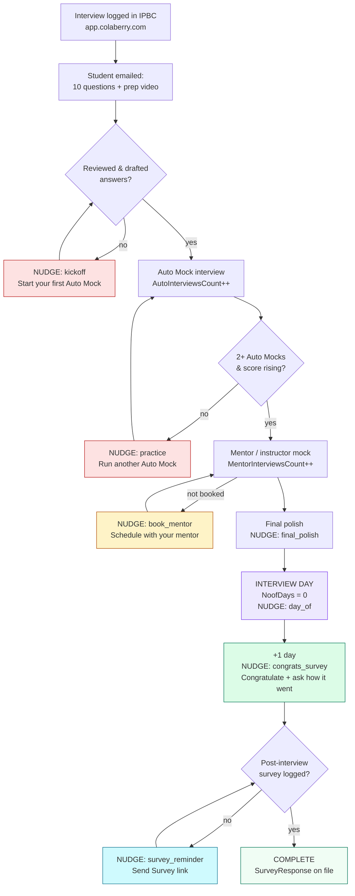

# IPBC Interview Preparation — Management Report + Nudge Engine

**Status:** report live; nudge engine built and **PREVIEW-gated** (no student emails until flipped to live).
**Owner:** Ali Muwwakkil. **Built:** 2026-06-10 (Session CC-20260610-iv9k).

This system does two things on top of the existing IPBC "Logged Interviews" workflow:

1. **A management report** that ranks every active interview by urgency × preparation and shows where each student is in the prep funnel (scatter plot + heatmap), so we are never blind to an interview happening with no prep behind it.
2. **A nudging engine** that pushes each student to their next funnel step with emails framed as coaching, flips to "how did it go" after the interview, and surfaces the post-interview **Send Survey link** queue.

Both read the same source of truth: CCPP view `vw_ColaberryInterviewPreparation_UpcomingInterviews` (validated live 2026-06-10). That view already pre-computes the prep score, the auto/mentor mock counts, the survey-response flag, and even scatter axes — so this layer is classification + delivery, not new measurement.

---

## The preparation funnel (what each interview moves through)



Each box that loops back is a place a student can stall. The nudge for that stall is named on the arrow. **The intent: every message reads as informative and encouraging, but each one is engineered to move the student exactly one step forward** — and after the interview we flip from "prepare" to "how did it go" so we stay on top of outcomes.

---

## Readiness & priority model (how the report ranks)

`readiness` (0–100%) blends three signals from the view:

| Signal | Weight | Source column |
|---|---|---|
| IPBC Preparation score | 45% | `Preparationscore` |
| Auto Mock interviews taken (target 3) | 30% | `AutoInterviewsCount` |
| Mentor mock done (binary gate) | 25% | `MentorInterviewsCount` |

`urgency tier` combines **days-to-interview × readiness**:

| Tier | Rule |
|---|---|
| TODAY | interview is today |
| CRITICAL | ≤ 2 days out **and** readiness < 60% |
| IMMINENT | ≤ 2 days out, prepared |
| AT_RISK | 3–5 days out **and** readiness < 50% |
| SOON | 3–5 days out, on pace |
| BEHIND | > 5 days but little/no prep |
| ON_TRACK | > 5 days, progressing |
| SURVEY OWED | interview passed, no survey on file |

The report sorts: **today → critical → survey-owed → at-risk → the rest**, and within a tier puts the **least-prepared first** (that is where a nudge changes the outcome).

---

## The two visualizations

- **Scatter — readiness vs. days-to-interview.** Y = readiness %, X = days until the interview (negative = already happened, survey owed). The **bottom-left red zone** is "interviewing soon, barely prepared" = act now. Rendered email-safe (table grid) in the email, and interactively (Chart.js) in the `-interactive.html` artifact.
- **Heatmap — student × prep signal.** One row per interview; columns When / Prep / Auto Mocks / Mentor Mock / Survey, cells colored green→red. Reads at a glance as "where is the gap."

---

## Nudge beats (student-facing)

| Beat | Fires when | Message flips them toward |
|---|---|---|
| `kickoff` | upcoming ≤10d, no prep started | first Auto Mock |
| `practice` | 1 Auto Mock in | 2+ Auto Mocks, higher score |
| `book_mentor` | enough Auto Mocks, no mentor mock | scheduling the instructor mock |
| `final_polish` | mentor mock done, interview ahead | one last Auto Mock |
| `day_of` | interview is today | good luck + log it right after |
| `congrats_survey` | +1 day after interview | **congratulate**, then survey |
| `survey_reminder` | ≥2 days past, no survey | the post-interview survey (Send Survey link) |

One beat per interview per day; a new beat only fires when the student advances a stage or the timeline crosses a threshold (idempotent via state file).

---

## Operating the system

**Management report** (safe, internal — emails Ali + Ram):
```
node backend/src/scripts/interviewPrepReport.js --dry     # build artifacts, no send
node backend/src/scripts/interviewPrepReport.js           # send
```

**Nudge engine** (PREVIEW by default — emails Ali a digest of what WOULD fire, sends students nothing):
```
node backend/src/scripts/dailyInterviewPrepNudges.js --dry     # digest preview only
node backend/src/scripts/dailyInterviewPrepNudges.js           # respects mode file
```

**Going live with student emails** is a deliberate switch:
```
# on the VPS:
echo live > tmp/ops-engine/interview-prep-nudge-mode.txt
# (future) from Basecamp: @CB System set interview nudge mode live
```
Default mode is `preview`. The engine fails safe to preview if the file is missing.

**Schedule:** both are registered in `backend/src/scripts/lib/reportingRegistry.js` and fire via the hourly orchestrator on weekdays.

---

## Files

| File | Role |
|---|---|
| `backend/src/scripts/lib/interviewPrepData.js` | Pure classifier (stage, urgency, readiness, priority). Unit-tested. |
| `backend/src/scripts/lib/renderInterviewPrepReport.js` | Email-safe HTML report (scatter + heatmap + priority + survey queue). |
| `backend/src/scripts/interviewPrepReport.js` | Report runner: CCPP → classify → render → artifacts → email Ali. |
| `backend/src/scripts/lib/interviewPrepNudges.js` | Pure student-facing nudge content per beat. |
| `backend/src/scripts/dailyInterviewPrepNudges.js` | Preview-gated nudge engine + Ali digest + state/idempotency. |

**Data source:** CCPP `vw_ColaberryInterviewPreparation_UpcomingInterviews`; student email via `vw_SyncIPBCUsers` (CandidateID = StudentUserID).
