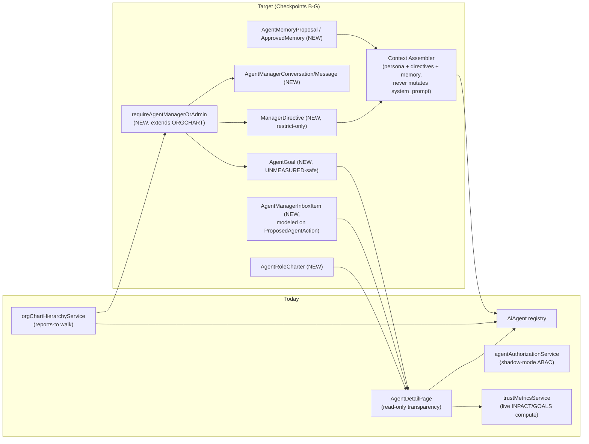

# Target Architecture (Checkpoint A proposal — not built)

This is a proposal for Checkpoints B–G, derived from `CURRENT_STATE.md` and `DOMAIN_REUSE_MAP.md`. **Nothing in this document is implemented.** Every new model listed here needs its own scoped PR, its own tests, and — per the mission's explicit build strategy — a STOP-and-review checkpoint before the next one starts.

## Guiding constraint

Every new table is FK'd to the real `ai_agents.id` and/or real `org_members.id`. None reuse the synthetic Workforce OS tables (`workforce_memory`/`workforce_tasks`/`workforce_messages`/`workforce_meetings`, keyed on fictional `employee_slug`s — `CURRENT_STATE.md` §E) and none reuse Maya's visitor-bound chat tables directly. Where an existing system's *pattern* is good (Maya's context assembly, the Workforce OS's roster→drawer UX, `ProposedAgentAction`'s status lifecycle, `mgmtRoles.ts`'s server-side section gate), the pattern is followed; the rows are not shared.

## Current vs. target, at a glance

## New models (proposed, Checkpoint A output — build order is Checkpoint B–E, not now)

| Model | FK anchor | Built in | Notes |
|---|---|---|---|
| `AgentRoleCharter` | `ai_agents.id` | Checkpoint B | Business-facing job description, separate from `system_prompt` |
| `AgentManagerConversation`, `AgentManagerMessage` | `org_members.id` ↔ `ai_agents.id` | Checkpoint C | Shape borrowed from `ChatConversation`/`ChatMessage`, not the rows |
| `ManagerDirective` | `ai_agents.id`, authored by `org_members.id` | Checkpoint C | Versioned, auditable, restrict-only (enforced against the agent's *current* effective authority, never expands it) |
| `AgentManagerInboxItem` | `ai_agents.id` | Checkpoint C | Status lifecycle modeled on `ProposedAgentAction` |
| `AgentReportSubscription`, `AgentReportRun` | `ai_agents.id`, `org_members.id` | Checkpoint D | Requires the `OrgMember` timezone column first (see below) |
| `AgentOneOnOne`, `AgentOneOnOneOutcome` | `ai_agents.id`, `org_members.id` | Checkpoint D | |
| `AgentGoal` | `ai_agents.id` | Checkpoint D | Renders `UNMEASURED` when no real metric backs it — never a fabricated number |
| `AgentMemoryProposal`, `AgentApprovedMemory` | `ai_agents.id` | Checkpoint E | Approval state must be provably read by the runtime context assembler before shipping — the `OpenclawLearning.applied` dead-flag failure mode is the thing to not repeat |

## Hard prerequisites, in order

1. **`requireAgentManagerOrAdmin` middleware** (`MANAGER_AUTHORIZATION_MAP.md`) — everything with a write path in Checkpoints C–E depends on this existing and being tested first. Until it ships, new manager-write capability stays `requireAdmin`-only (see that doc's Gate A answer).
2. **`OrgMember.timezone` column** (`COMMUNICATION_MAP.md` §7) — hard prerequisite for any scheduled feature (report cadence, 1:1 reminders) in Checkpoint D.
3. **Durable-instruction runtime injection point** — a context assembler that reads `ManagerDirective` (and later `AgentApprovedMemory`) at request/run time and injects them alongside the existing `system_prompt`, without ever writing into it. Pattern reference: Maya's assembly pipeline (persona + context + memory-summary + RAG + tool-loop) — code is new, shape is proven.

## Explicit non-goals of Checkpoint A

No route, model, migration, or UI component is created by this document or by Checkpoint A. No production deploy. No enforcement flip (authorization stays shadow-mode). This is the architecture proposal the mission asked for before "the existing systems and safest integration points have been proven" — the proving is `CURRENT_STATE.md`/`DOMAIN_REUSE_MAP.md`; this document is what to build once Ali reviews and green-lights Checkpoint B.
