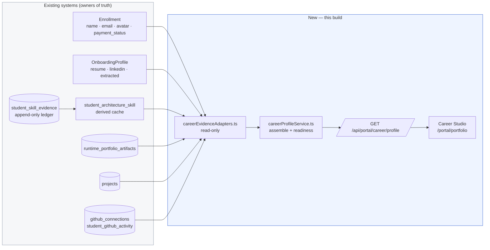
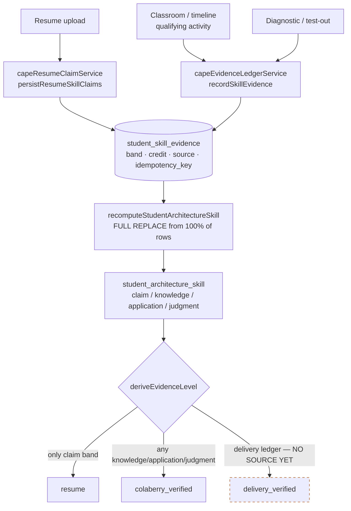
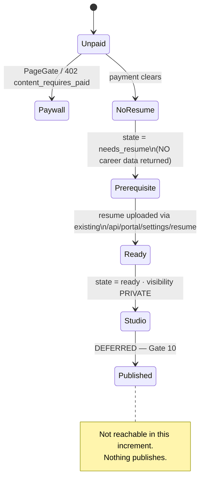
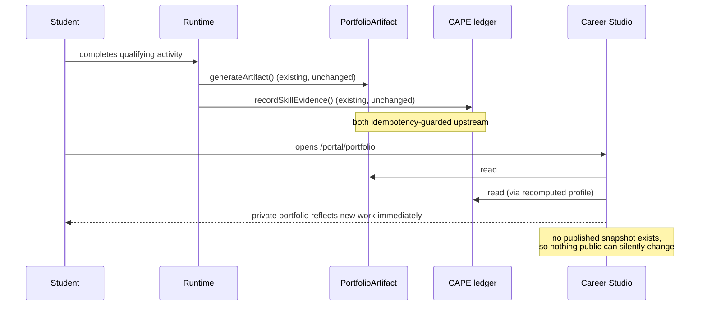
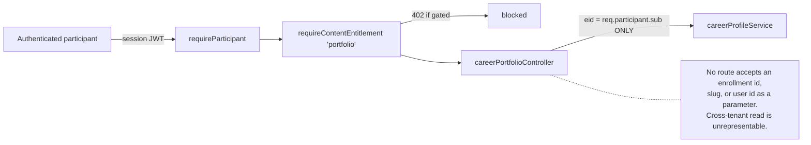

# TARGET_ARCHITECTURE (Gate 0 → Gate 8)

## Governing decision

> The Career Studio is a **read-only projection** assembled on request from systems that
> already own their data. It adds no tables, no columns, and no migrations.

Every alternative considered required duplicating either resume truth, skill evidence, or XP —
each of which is an explicit stop condition in plan §71.

## 1. Person-level CareerProfile sources

Note the arrow direction: **nothing points back into the existing systems.** The Studio is a
pure sink.

## 2. Skill provenance — how a capability earns its level

`delivery_verified` is drawn dashed because it is contractually present and empty — see
`REFACTORED_INTEGRATION_MAP.md`.

## 3. Access state machine (Gate 1)

## 4. Classroom → portfolio growth

Plan §18's invariant — *private portfolio updates automatically, published snapshot does not
silently change* — holds trivially here: there is no published snapshot.

## 5. Privacy boundary

## Module inventory

| File | Lines (target) | Responsibility |
|---|---|---|
| `backend/src/services/career/careerEvidenceAdapters.ts` | <300 | Read-only adapters over the six existing sources |
| `backend/src/services/career/careerReadiness.ts` | <150 | Configurable readiness policy + computation |
| `backend/src/services/career/careerProfileService.ts` | <260 | Access state machine + assembly |
| `backend/src/schemas/careerPortfolioSchema.ts` | <130 | Zod response contract |
| `backend/src/controllers/careerPortfolioController.ts` | <80 | HTTP + dev contract validation |
| `backend/src/routes/careerPortfolioRoutes.ts` | <30 | Route wiring + entitlement |
| `frontend/src/services/careerApi.ts` | <120 | Typed client mirroring the Zod schema |
| `frontend/src/pages/portal/portfolio/*` | <300 each | Career Studio sections |

All within the root CLAUDE.md size targets (~300 soft / 500 hard per file).

## Deferred diagrams

Plan §68 lists 15 diagrams. The seven above cover every subsystem this increment builds. The
remaining eight (multi-repo analysis, team contribution, readiness→review→publication,
versioned snapshots, recruiter portfolio, talent network, employer analytics loop, legacy
migration) describe gates 5, 6, 9b, 10–14 and are deliberately not drawn — drawing an
architecture for code that does not exist would misrepresent what shipped.
