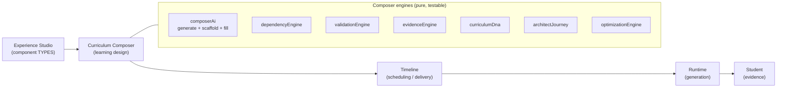

# Phase 2 — Curriculum Composer (AI Curriculum Operating System)

**Status:** implemented (v1, integrated end-to-end). **Session:** CC-20260708-q7m3. **Date:** 2026-07-09.

The Curriculum Composer sits **between Experience Studio and the Timeline**. An instructor describes an outcome in natural language; the AI Curriculum Architect assembles a week from **real Experience Studio component types**, scores it, recommends fixes, and — only when validation passes — publishes real cards to the Timeline. Experience Studio is untouched (it remains the permanent AI Component Library).

## Architecture

The **Blueprint** is the source of truth (`curriculum_blueprints`). From it the Composer derives a **Plan** (an ordered list of `PlanCard`s, each an instance of a registry type — never hardcoded). Every engine is a pure function over `PlanCard[]` + the Curriculum Type Registry, so the Quality/Coverage/Readiness math is deterministic and unit-tested. The LLM only does two things — **assemble** a plan and **fill** a card — and both have a pure scaffold fallback, so the Composer works with no OpenAI key and never yields an empty week.

| Engine | Responsibility | File |
|---|---|---|
| Generator + scaffold + fill | LLM assembly of a plan from real types; deterministic fallback; Blueprint-aware Fill-with-AI | `services/composer/composerAi.ts` |
| Dependency | Prereqs must appear earlier (Prompt Lab needs Overview+Video) — graph + warnings | `services/composer/dependencyEngine.ts` |
| Evidence | Estimate GitHub / portfolio / XP / readiness / certification from registry flags | `services/composer/evidenceEngine.ts` |
| Validation | Pass/warn/fail battery → Quality / Coverage / Readiness; publish gate | `services/composer/validationEngine.ts` |
| DNA | The fingerprint (purpose, outcomes, evidence, focus stage, scores) | `services/composer/curriculumDna.ts` |
| Architect Journey | Map competencies → the 7-stage path; name the stage the plan advances | `services/composer/architectJourney.ts` |
| Optimization | Ranked, explained, one-click recommendations | `services/composer/optimizationEngine.ts` |
| Orchestration | Blueprint CRUD + generate + assess | `services/composer/blueprintService.ts` |
| Publish | Plan → real Timeline cards via `timelineAdminService.createCard` (gated by validation) | `services/composer/publishService.ts` |

## Database changes
New table **`curriculum_blueprints`** (idempotent `ensureCurriculumComposerSchema` boot migration — prod runs compiled dist, no sync). Columns: identity + program/cohort/week/session/scope/difficulty/estimated_hours; JSONB `learning_objectives, competencies, architect_domains, bloom, evidence_produced, github_deliverables, portfolio_deliverables, certification_mapping, unlock_rules, completion_rules, success_criteria, risk_areas, student_outcomes`; XP + `architect_readiness`; `generated_plan` + `dna` (JSONB); `quality_score / coverage_score / readiness_score`; `status` (draft→generated→validated→published); `published_card_ids`. No changes to any existing table. Publishing writes to the existing `timeline_cards` via the admin service.

## API changes (all `requireAdmin`, `/api/admin/composer/*`)
| Method | Path | Purpose |
|---|---|---|
| GET | `/palette` | The buildable component-type palette (non-system, non-event) |
| GET | `/architect-journey` | The 7-stage journey |
| POST | `/generate` | Quick generate a plan + assessment from a prompt (preview, not persisted) |
| POST | `/fill-card` | Blueprint-aware Fill-with-AI for one card |
| GET/POST | `/blueprints` | List / create blueprints |
| GET/PUT/DELETE | `/blueprints/:id` | Read (with full assessment) / update / delete |
| POST | `/blueprints/:id/generate` | Generate + persist plan + DNA + scores |
| GET | `/blueprints/:id/validate` | Re-assess the stored plan |
| POST | `/blueprints/:id/publish` | Publish to the Timeline (blocked unless validation passes) |

## Frontend
New Orchestration tab **Curriculum Composer** (`pages/admin/orchestration/composer/`): a four-pane workspace — **Blueprint** (source of truth, editable) · **Timeline Canvas** (the generate prompt → cards in bucket lanes with dependency flags) · **AI Architect** (quality ring, coverage/readiness meters, focus stage, ranked recommendations with one-click Apply) · **Evidence & Outcomes** (GitHub/portfolio/XP/employment value) — over a sticky **validation/publishing status bar** and the **Architect Journey** stepper. `composerKit.tsx` holds the shared design system + API client + primitives. Experience Studio is unmodified.

## Testing
`services/composer/__tests__/composerEngines.test.ts` — 11 tests: scaffold assembly + dependency-clean sequence, dependency ordering, evidence estimation, validation pass/fail + publish gate, journey mapping, DNA derivation, optimization ranking. Backend `tsc` clean; the pure engines are fully deterministic.

## Demonstrated (STOP CONDITION)
An instructor describes an outcome ("Teach Prompt Engineering during Week 4") → the Architect generates a 15-card week from real components → the engines validate (dependency-clean, publishable) + score (quality/coverage/readiness) + estimate evidence + name the Architect-journey stage → **Publish** writes real cards to the global Timeline. Generate scales across scopes (lesson/session/day/week/sprint/month/certification_module/internship/program) via the same architecture.

## Known limitations (honest)
- **Continuous cross-cohort optimization** (learn-from-analytics-every-cohort) is scaffolded via the optimization engine but not yet fed by production completion analytics — that loop lands when runtime telemetry accumulates.
- **Events / Sessions as reusable containers** are represented in the type registry (event types) but the dedicated Event/Session Composer UIs are v2.
- **Calendar drag-drop scheduling** and **version-to-version diff on regenerate** are described in the spec and deferred.
- **Program-scale generation** uses the week architecture repeated; a true multi-week program planner is a follow-on.
- The generator's LLM path depends on the prod OpenAI key; the deterministic scaffold covers the no-key/dev path and guarantees a valid week.

## Production readiness score: **7.5 / 10**
Core loop (describe → generate → validate → publish) is real, integrated, tested, and gated. Deductions: analytics-fed optimization, Event/Session/Calendar UIs, and program-scale planning are v2; publish is create-only (no reconciliation/unpublish yet).
