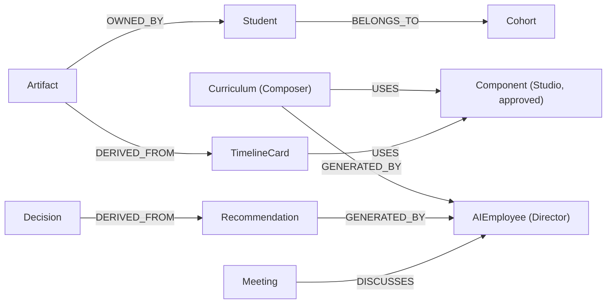

# Phase 6 — Enterprise Intelligence Layer ("The Brain")

**Status:** implemented (v1 core, integrated end-to-end). **Session:** CC-20260708-q7m3. **Date:** 2026-07-09.

Phase 6 builds **intelligence, not an application**: a shared reasoning layer every module consumes. Its heart is the **Enterprise Memory Graph** — every entity becomes a node, every connection a first-class relationship — plus shared services (global search, evidence-backed reasoning, the Decision Engine, the one organizational timeline). The AI Directors now reason over connected organizational memory instead of isolated tables.

## Enterprise Constitution (realized)
1. **Everything has identity** — every student, curriculum, component, meeting, AI employee, artifact, recommendation, decision is a `graph_nodes` row (id, type, metadata, owner, trust, version, status).
2. **Everything has relationships** — `graph_edges` are first-class (type, strength, confidence, evidence): `BELONGS_TO`, `GENERATED_BY`, `DERIVED_FROM`, `USES`, `REPORTS_TO`, `DISCUSSES`, `OWNED_BY`.
3. **Everything produces evidence** — recommendations → decisions carry evidence node refs; reasoning walks the evidence path; nothing is unexplained.
4. **Everything becomes memory** — `graph_events` is the permanent organizational timeline; `decisions` records reason/alternatives/expected-vs-actual/lessons.
5. **Everything is searchable** — one global search over the graph (relationship-aware; NL intents).

## Memory Graph schema

Tables: `graph_nodes`, `graph_edges`, `graph_events`, `decisions` (idempotent `ensureIntelligenceSchema`; **no existing table touched**).

## Shared intelligence services
`graphService` (upsert/relate/recordEvent/neighbors/stats) · `ingestService` (projects every module into the graph — the platform becomes one connected system) · `searchService` (global, relationship-aware) · `reasoningService` (directors reason over the graph + self-explaining `explainNode`) · `decisionService` (recommendation → traceable Decision + lifecycle).

## API (admin, `/api/admin/brain/*`)
`POST /ingest` · `GET /graph/stats` · `GET /search?q=` · `GET /node/:id` · `GET /explain/:id` · `GET /type/:type` · `GET /reason/:domain` · `GET /timeline` · `GET/POST /decisions` · `PUT /decisions/:id` · `GET /decisions/:id/trace`. (Namespaced `/brain` to avoid the existing Cory `/api/admin/intelligence`.)

## Navigation cleanup (first objective)
- **Operations Center merged into AI Organization** — its Mission Control IS the AI Workforce home; the duplicate nav item is removed and `/admin/ops-center` redirects to `/admin/workforce`.
- **Orchestration tabs pruned** to the forward pipeline — **Curriculum Composer → Experience Studio → Timeline** (+ Analytics, Health). Legacy pre-redesign tabs (Blueprint/Overview/Sessions/Sections/Mini-Sections/Artifacts/Skills/Gating/Workstation/Bulk) retired from the nav (components retained in code).
- **One new surface** — `/admin/brain` (Enterprise Intelligence): global search, Knowledge Explorer, graph stats, organizational timeline, Decision log.

## Frontend
`EnterpriseIntelligencePage` reuses the **shared design tokens** (Phase 5 `themeKit`, light-default + dark — no module-specific theme): global search → results → **Knowledge Explorer** drawer (a node's relationships + self-explaining trace), memory-graph stats, organizational timeline, and the Decision Engine log with lifecycle.

## Known limitations (honest, v2)
- **Semantic search** is keyword + relationship-aware + NL intents; embeddings-based ranking is a follow-on.
- **Multi-tenant isolation**, **per-object Digital Twins for everything** (the Curriculum Twin ships in Ops), and the **full self-improvement loop** (measure → learn → adjust automatically) are architected but v2.
- Ingest runs on demand (Rebuild button) + is bounded (students capped 300); a change-data-capture stream is the scale path.
- The reasoning layer wraps the deterministic director analyses with graph evidence; deep LLM chain-of-thought over the graph is a follow-on.

## Production readiness score: **6 / 10**
The core is real, integrated, and deployed: a live memory graph the platform ingests every module into, global search, self-explaining reasoning, and a traceable Decision Engine — the platform now reasons through one shared layer. Deductions: embeddings semantic search, multi-tenant, universal twins, and the closed self-improvement loop are v2.
