# Experience Studio — Architecture & Diagrams

**Status:** implemented. **Session:** CC-20260708-q7m3. **Date:** 2026-07-09.

The Experience Studio is the AI-native Component Platform: every `curriculum_type_definition` is a **versioned, prompt-driven AI Component** that authors *design* (not fill out as a form). This document is the visual reference — 10 Mermaid diagrams covering system layers, the runtime, the prompt pipeline, the renderer engine, the lifecycle, capabilities, dependencies, AI generation, cost estimation, and versioning.

> All diagrams are Mermaid. GitHub renders them inline; in VS Code use the Markdown Preview Mermaid extension.

---

## 1. System architecture (layers)

How the browser Studio, the admin HTTP boundary, the component services, the AI/instrumentation layer, and Postgres relate.

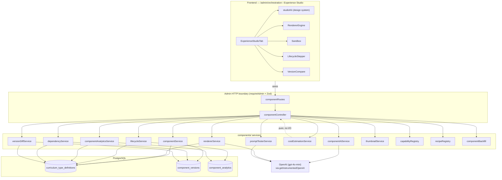

---

## 2. Component runtime (a student session)

What happens when a student opens a component-backed card. The generation prompt produces the experience; the renderer surfaces it; analytics records the run.

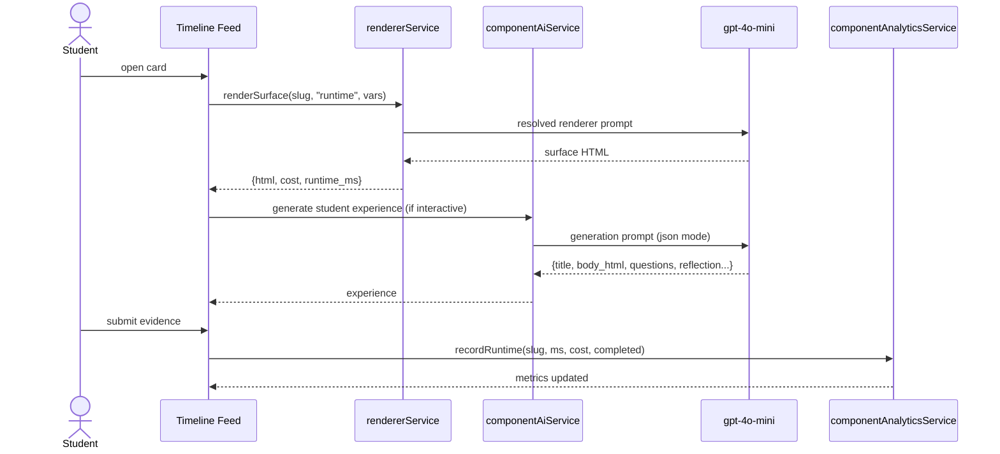

---

## 3. Prompt pipeline (7 authoring stages)

Each component owns a bundle of 7 prompts. The Studio pipeline editor walks them in order; each is independently testable.

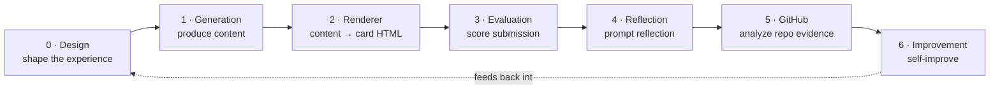

---

## 4. Renderer Engine (8 surfaces)

The Renderer Definition: one prompt per surface. The component defines *how it renders itself* on every surface — nothing is hardcoded.

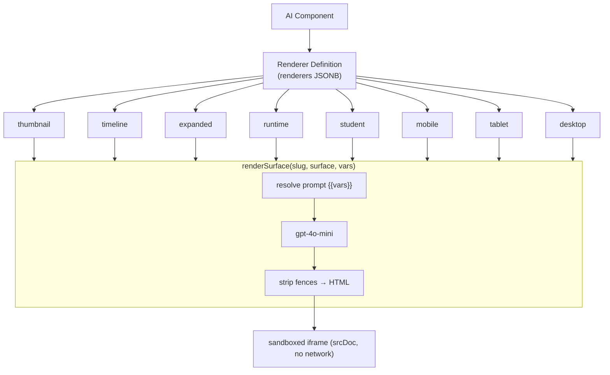

---

## 5. Runtime lifecycle (10 states)

Authoring states (`draft → generated → validated → published`) are settable with transition validation; runtime states (`student_opened → generated_runtime → completed → evaluated`) are *observed* from analytics. `archived` and `version_locked` are terminal-ish.

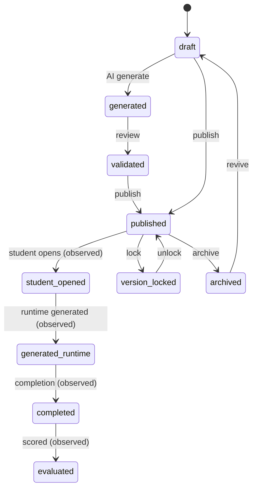

---

## 6. Capability composition

A component composes reusable Capability Modules (25 of them). The 5 legacy boolean flags map onto module ids for back-compat, so nothing breaks.

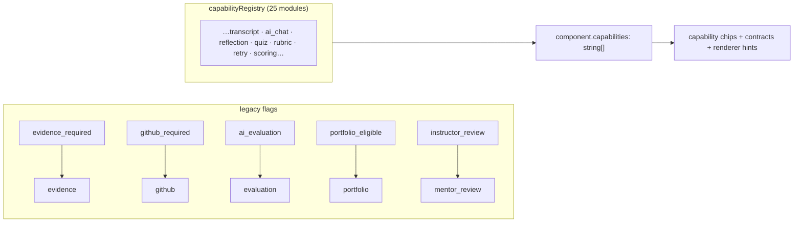

---

## 7. Dependencies + cycle prevention

Components can require other components. `setDependencies` runs a pure DFS (graph coloring) that rejects any edge which would create a cycle.

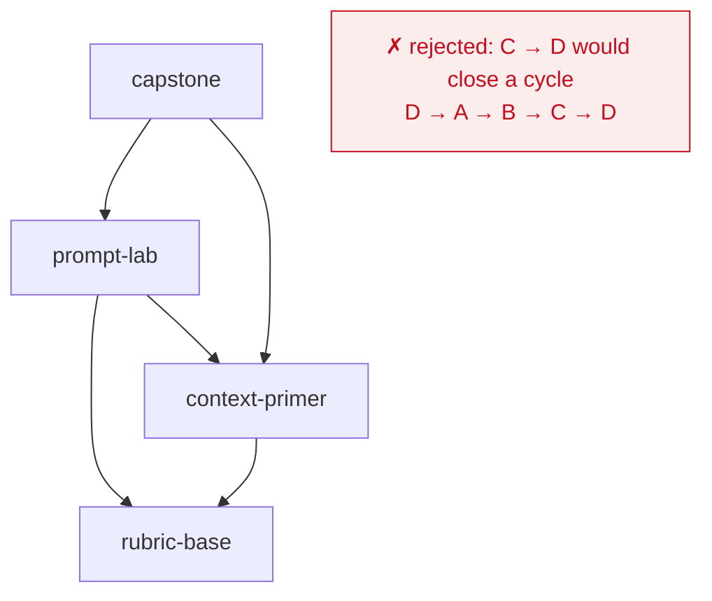

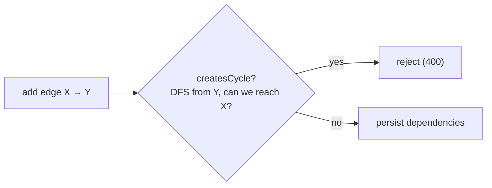

---

## 8. AI generation (text → component)

`generateComponent("Create a Prompt Lab that teaches Context Engineering", recipe)` designs a full component draft; the author reviews then creates it (slug de-duped).

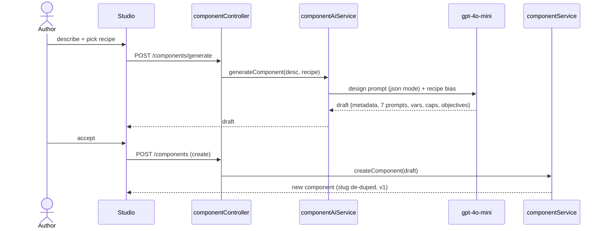

---

## 9. Cost estimation (pure, table-driven)

`costEstimationService` has zero I/O. Every prompt's tokens (~4 chars/token), price (`MODEL_PRICING` per 1M), and runtime (base latency + decode rate) are pure functions — identical across preview, admin, and runtime.

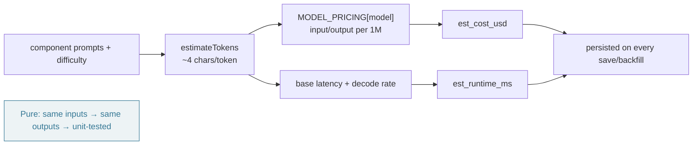

---

## 10. Versioning (snapshot · restore · compare)

Every edit snapshots the prior state into `component_versions` (append-only) and bumps `component_version`. Restore applies an old snapshot as a *new* version — never destructive. Compare diffs any two snapshots field-by-field.

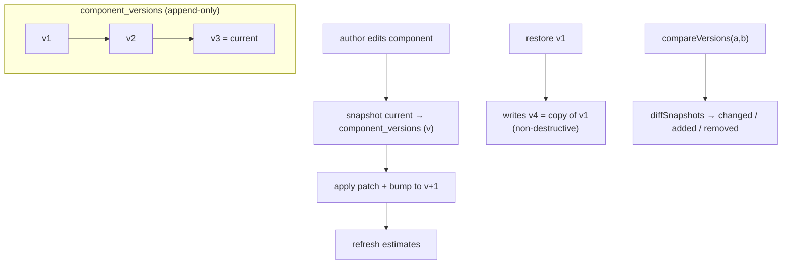

---

## Module map (source of truth)

| Concern | File |
|---|---|
| Registry service (CRUD, versions, export/import) | `backend/src/services/components/componentService.ts` |
| Renderer Engine (8 surfaces) | `backend/src/services/components/rendererService.ts` |
| Lifecycle (10 states) | `backend/src/services/components/lifecycleService.ts` |
| AI (generate · co-design · runtime preview) | `backend/src/services/components/componentAiService.ts` |
| Analytics (seeded deterministic) | `backend/src/services/components/componentAnalyticsService.ts` |
| Dependencies + cycle prevention | `backend/src/services/components/dependencyService.ts` |
| Version diff | `backend/src/services/components/versionDiffService.ts` |
| Cost estimation (pure) | `backend/src/services/components/costEstimationService.ts` |
| Prompt tester (live) | `backend/src/services/components/promptTesterService.ts` |
| Thumbnails (SVG data-URI) | `backend/src/services/components/thumbnailService.ts` |
| Capability / Recipe registries | `backend/src/services/components/{capabilityRegistry,recipeRegistry}.ts` |
| Backfill | `backend/src/services/components/componentBackfill.ts` |
| HTTP boundary | `backend/src/controllers/componentController.ts` · `backend/src/routes/admin/componentRoutes.ts` |
| Studio UI | `frontend/src/pages/admin/orchestration/ExperienceStudioTab.tsx` + `studio/*` |
| Design system | `frontend/src/pages/admin/orchestration/studio/studioKit.tsx` |
