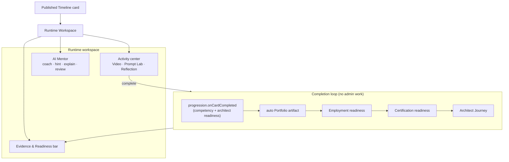

# Phase 3 — Learning Runtime Intelligence (LRI)

**Status:** implemented (v1, integrated end-to-end). **Session:** CC-20260708-q7m3. **Date:** 2026-07-09.

The Learning Runtime is the operating system a student lives inside. It **consumes** the frozen Experience Studio → Curriculum Composer → Timeline → Progression pipeline (it never creates or edits curriculum) and wraps a published Timeline card in a premium workspace: a live **AI Mentor**, interactive **activity runtimes**, and an **Evidence & Readiness** engine that turns every completion into employable proof.

## Architecture
The Runtime **consumes** the existing progression engine (`progressionService.onCardCompleted` already updates competency + architect readiness) and layers the new intelligence on top. Two readiness engines are **pure + deterministic**; the mentor / prompt-lab / video-augment / portfolio-artifact use the LLM with graceful fallbacks.

| Piece | Responsibility | File |
|---|---|---|
| AI Mentor | Socratic coach (explain/hint/review) that never hands over graded answers; reflection prompts; video augmentation. Persists turns for memory. | `services/runtime/mentorService.ts` |
| Prompt Lab runtime | Write → run → AI evaluation (craft + Architect score, strengths/gaps/suggestions/better prompt) | `services/runtime/promptLabRuntime.ts` |
| Employment Readiness | **Pure** — 11 employer-legible skill scores + band + "what employers still need" | `services/runtime/employmentReadiness.ts` |
| Certification Readiness | **Pure** — competencies → Anthropic domains → pass probability + next activities | `services/runtime/certificationReadiness.ts` |
| Portfolio | Auto-generates an employable artifact on evidence completion (no manual portfolio) | `services/runtime/portfolioService.ts` |
| Notebook | Notes / bookmarks / highlights / flashcards, searchable | `services/runtime/notebookService.ts` |
| Orchestrator | openCard + completeActivity (progression → artifact → readiness) + readiness snapshot | `services/runtime/runtimeService.ts` |

## Database changes
Three new tables (idempotent `ensureRuntimeSchema` boot migration; **no existing table touched**): `runtime_mentor_turns` (mentor memory), `runtime_portfolio_artifacts` (auto-built portfolio), `runtime_notes` (AI Notebook). The Runtime reads existing `timeline_cards` + progression tables; it writes only its own tables + the progression it delegates to.

## API changes (participant-auth, `/api/portal/runtime/*`)
| Method | Path | Purpose |
|---|---|---|
| GET | `/cards/:id` | Open a published card for the runtime |
| POST | `/cards/:id/mentor` | Ask the AI Mentor (mode: ask/hint/explain/review) |
| GET | `/cards/:id/reflection` | AI-guided reflection prompts |
| POST | `/cards/:id/video-augment` | Chapters / summary / quiz / flashcards |
| POST | `/cards/:id/prompt-lab` | Evaluate a prompt (score + architect score + better prompt) |
| POST | `/cards/:id/complete` | Complete → progression + auto artifact + readiness |
| GET | `/readiness` | Employment + Certification + Architect Journey + evidence |
| GET/POST/DELETE | `/notebook(/:id)` | The AI Notebook |

## Frontend
New immersive route `/portal/runtime/:cardId` (`pages/portal/runtime/`): a full-screen workspace — a calm activity center (renders Video via the in-app player, Prompt Lab, or AI-guided Reflection by `render_band`), a live **AI Mentor** rail (chat + hint/explain/review shortcuts), and a bottom **Evidence & Readiness** bar (Employment overall + band, Certification pass %, Architect stage, GitHub, Portfolio, Builder XP, and "what employers still want"). Launched from the Classroom card drawer's **Enter workspace →**. `runtimeApi` + `runtimeKit` hold the client + stylesheet.

## Demonstrated (STOP CONDITION)
A student opens a published Timeline card → gets AI coaching (never answers) → works the activity (prompt lab evaluated / video made interactive / AI-guided reflection) → **Complete** runs the whole loop with no admin work: progression (competency + architect readiness) → an auto-generated portfolio artifact → recomputed Employment + Certification readiness → Architect Journey progress. All surfaced live in the bottom bar.

## Known limitations (honest, v2)
- **Voice/camera mock interviews**, **flashcard spaced-repetition**, **social learning** (study groups/leaderboards/peer review), and the **full instructor dashboard** are represented at the data/engine layer but not fully built as UIs.
- **Adaptive difficulty regeneration** (auto-generate an easier/harder lab on struggle/excel) is scaffolded via the mentor + Composer but not yet an automatic loop.
- **GitHub live connection** shows estimated evidence; a live GitHub OAuth sync is a follow-on (the estimate is deterministic from completed evidence).
- Mentor memory persists turns but does not yet do long-horizon misconception modeling across weeks.
- LLM paths depend on the prod OpenAI key; all have deterministic fallbacks so the runtime never dead-ends.

## Production readiness score: **7 / 10**
The STOP-CONDITION loop (open card → coach → work → complete → evidence + portfolio + competency + journey + employment + certification, no admin work) is real, integrated, and deployed. Deductions: voice/camera interviews, social learning, full instructor dashboard, live GitHub OAuth, and automatic adaptive regeneration are v2.
