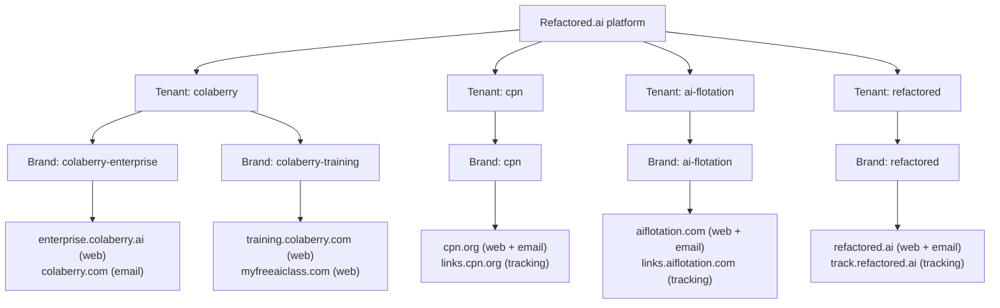
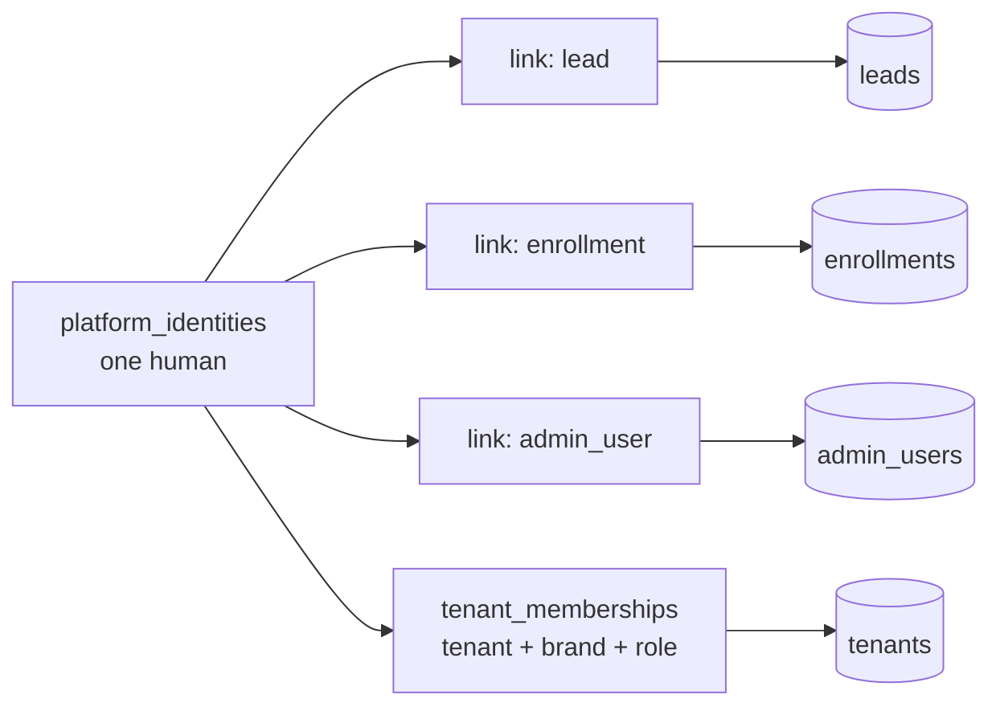
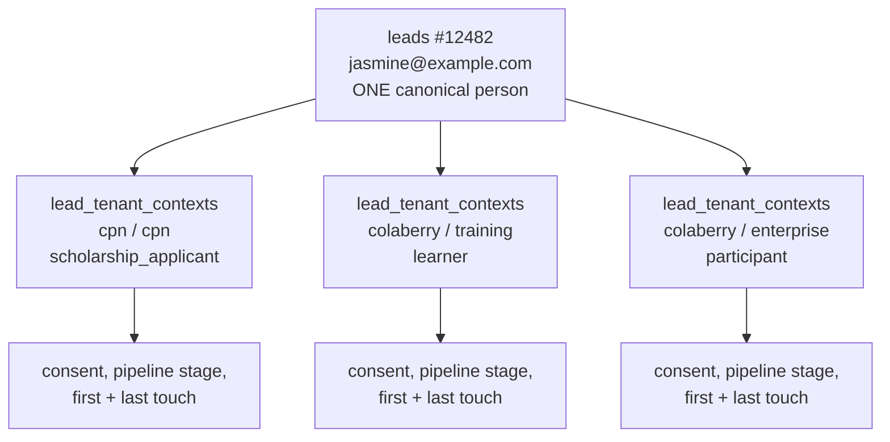
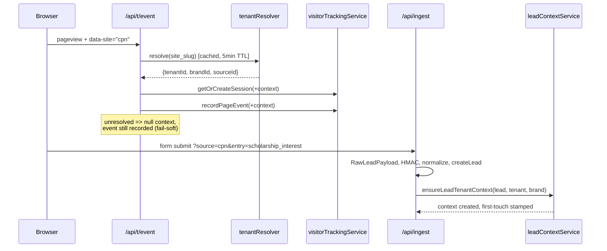
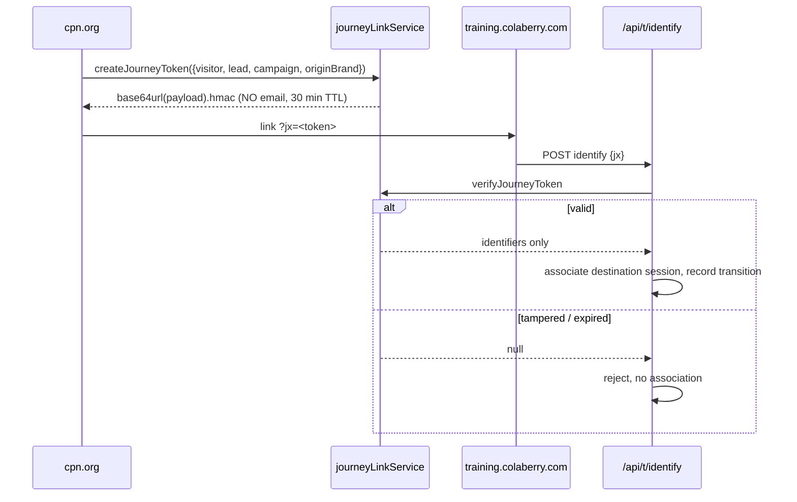
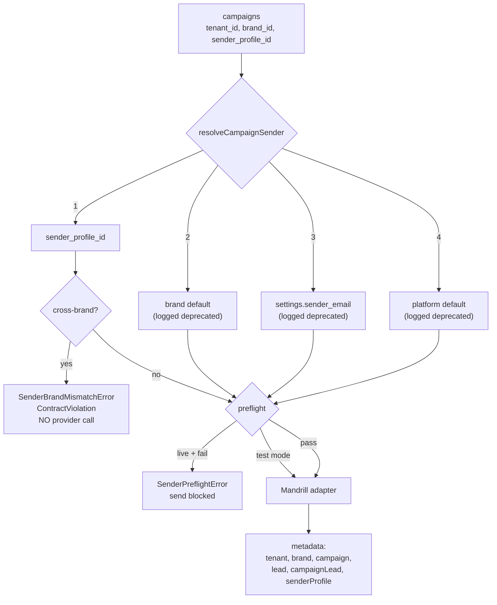
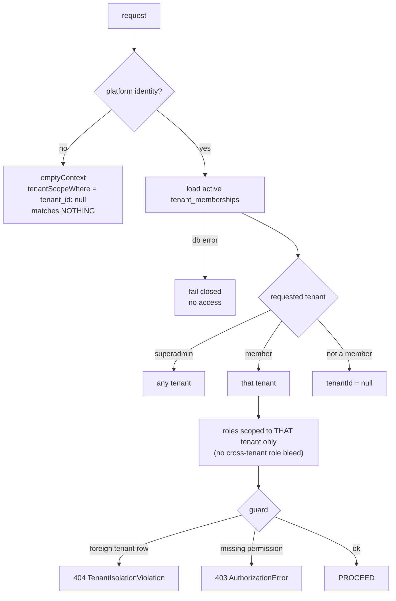
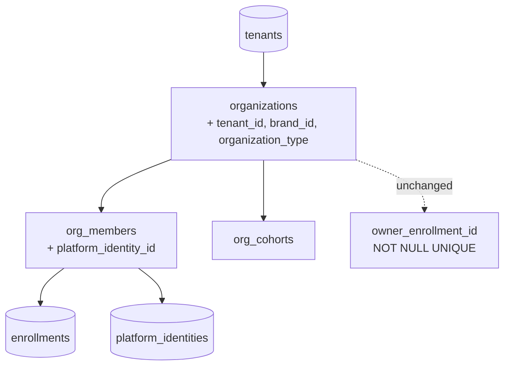
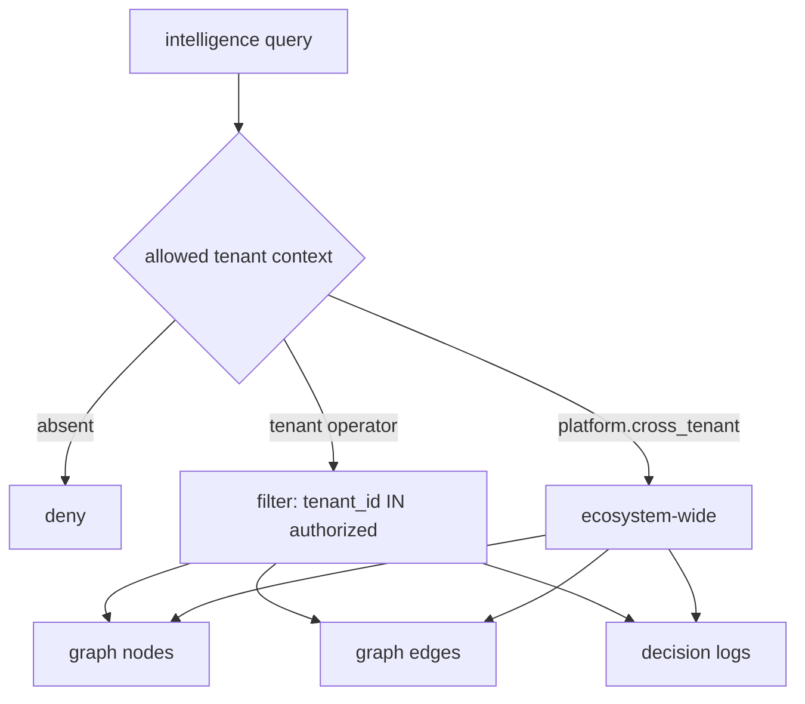

# Target Architecture

**Session:** CC-20260821-m6t4 · **Base:** `bb152ded`

---

## 1. Ecosystem tenant / brand map



One tenant may own several brands. Colaberry does; the other three do not, yet. That is
exactly why tenant and brand are separate tables rather than one.

## 2. Identity model



The three existing identity tables are untouched. `platform_identity_links` bridges them,
with `UNIQUE(link_type, linked_entity_id)` so one lead can belong to exactly one human.

## 3. Lead + tenant context



Consent lives on the context, not the lead. Consenting to CPN scholar updates grants
AI Flotation nothing.

## 4. Anonymous visitor to identified lead



## 5. Cross-domain journey



The v1 `?email=` path still works for existing sites and is logged. New ecosystem flows
use `jx` only.

## 6. Campaign to Mandrill



## 7. Tenant authorization request flow



Resolution fails soft. Authorization fails closed. That asymmetry is the core invariant.

## 8. Extraction boundaries

```mermaid
graph LR
  subgraph apps
    A1[cpn-public]
    A2[ai-flotation-public]
    A3[refactored-public]
  end
  subgraph packages
    K1[app-build]
    K2[brand-system]
    K3[tracking-sdk]
  end
  BE[backend HTTP API]
  A1 --> K1 & K2 & K3
  A2 --> K1 & K2 & K3
  A3 --> K1 & K2 & K3
  A1 -.HTTP.-> BE
  A2 -.HTTP.-> BE
  A3 -.HTTP.-> BE
  A1 -x A2
  A1 -x BE
```

Enforced by `scripts/validate-app-boundaries.js`, which exits non-zero on a forbidden
edge. Verified to fail on a deliberately planted violation, not merely to pass.

## 9. Organization membership



`owner_enrollment_id` is deliberately untouched. Making organizations creatable without
an enrollment is real work on the registration path and belongs to the CPN product
project.

## 10. Intelligence tenant isolation



Cross-tenant reasoning requires the explicit `platform.cross_tenant` permission, which
only `platform_super_admin` carries. Holding an admin token grants it nothing.
