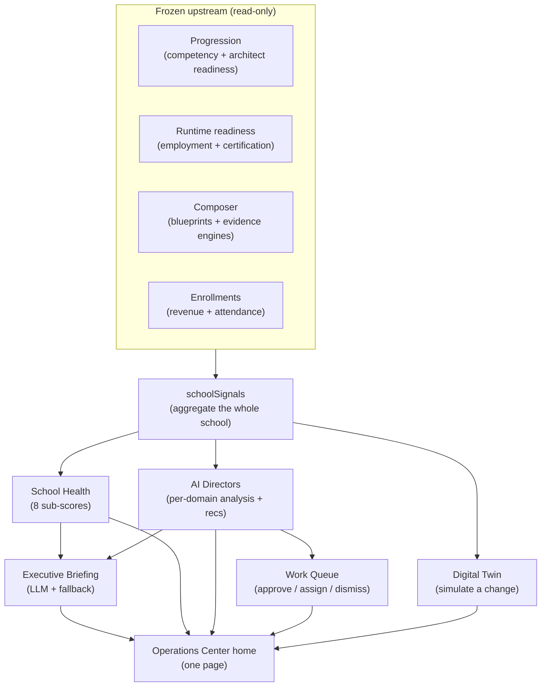

# Phase 4 — AI Operations Center (School Intelligence Platform)

**Status:** implemented (v1, integrated end-to-end). **Session:** CC-20260708-q7m3. **Date:** 2026-07-09.

The Operations Center is the school's central nervous system: one executive Mission-Control page that answers *what happened · why · what needs attention · what AI recommends · what actions*. It **consumes** the frozen upstream systems (Studio, Composer, Timeline, Runtime, Progression, Evidence) **read-only** — it aggregates people, learning, curriculum, employment, certification, revenue, and community, and turns findings into trackable work.

## Architecture
`schoolSignals.gatherSignals()` aggregates every active student by calling the frozen services (runtime `studentSignals` + the pure readiness engines) plus cheap enrollment/level rollups → one `SchoolSignals` vector. From it: `schoolHealth` (pure, 8 sub-scores + weighted overall), the **AI Directors** (`directors.ts`, rule-based per-domain analysts that emit ranked recommendations with why/evidence/impact/confidence/action), the **Executive Briefing** (LLM synthesis + deterministic fallback), the **Digital Twin** (`digitalTwin.ts`, simulates a curriculum change against the Composer engines), and the **Work Queue** (director recommendations upserted into `ops_recommendations`, status preserved). `opsService.homePayload()` composes the single home page.

| Piece | File |
|---|---|
| School aggregation (read-only) | `services/ops/schoolSignals.ts` |
| School Health (pure, 8 subs) | `services/ops/schoolHealth.ts` |
| AI Directors (7 domains, ranked recs) | `services/ops/directors.ts` |
| Executive Briefing (LLM + fallback) | `services/ops/executiveBriefing.ts` |
| Digital Twin (simulate) | `services/ops/digitalTwin.ts` |
| Orchestration + Work Queue + Search | `services/ops/opsService.ts` |

## Database changes
One new table `ops_recommendations` (the Work Queue; idempotent `ensureOpsCenterSchema`; **no existing table touched**). Everything else is computed live from the read-only upstream tables.

## API changes (admin-auth, `/api/admin/school/*` — namespaced to avoid the existing `/api/admin/ops`)
| Method | Path | Purpose |
|---|---|---|
| GET | `/home` | The single executive home payload |
| GET | `/health` | School Health score + signals |
| GET | `/directors` | Full AI Director analyses |
| GET/PUT | `/work-queue(/:id)` | The Work Queue + approve/assign/dismiss |
| POST | `/twin/simulate` | Digital-Twin simulation of a curriculum change |
| GET | `/search?q=` | Global roster search (architect-ready / at-risk / no-github / …) |

## Frontend
New top-level admin route `/admin/ops-center` + nav link. `OperationsCenterPage` is a dark Mission-Control home: **Executive Briefing** (good morning / yesterday / priorities / risks / wins), **School Health** (big score + 8 sub-bars), **Critical Alerts**, the **AI Executive Team** grid (7 Directors with headline metrics + top recommendation), the **Work Queue** (Approve / Assign / Dismiss), a **Digital-Twin** simulate widget, and **global search**.

## Demonstrated (STOP CONDITION)
The CEO opens one page and immediately sees what happened (briefing + health), why (director headlines + evidence), what needs attention (critical alerts + at-risk count), what AI recommends (ranked Work Queue with why/impact/confidence), and what actions can be taken (Approve / Assign / Dismiss, plus Digital-Twin what-ifs) — without opening any other part of the system.

## Known limitations (honest, v2)
- **Full AI Board of Advisors debate** (directors argue a decision, executive adjudicates) is represented by the ranked recommendations; the multi-agent debate transcript UI is v2.
- **Automation** turns a recommendation into status today; wiring to Basecamp/Slack/Calendar/email send is the next step (the action_type is carried on every rec).
- **Per-Director deep-dive pages** (Student/Curriculum/Employer/Certification centers) beyond the home summary are v2.
- **Operational timeline** (event history) and **full analytics trends** are v2.
- School aggregation computes live per active student (capped at 200); large schools should move to a nightly snapshot + cache.
- Admissions/Instructor directors are lightweight until those data sources are richer.

## Production readiness score: **6.5 / 10**
The STOP-CONDITION home page is real, integrated, deployed, and answers all five questions from live school data with a working Work Queue + Digital Twin. Deductions: board-debate UI, automation send, per-director pages, operational timeline, and snapshot-based scale are v2.
