# Target Architecture

**Session:** CC-20260823-r4k9 · **Base:** `d1d46d1e` · **Gate:** 0

The 14 diagrams required by master plan §18. These are the **target**; nothing below is
built. Where a box is already real on `origin/main` it is marked `[exists]`.

---

## 1. Tenant / organization / engagement / project

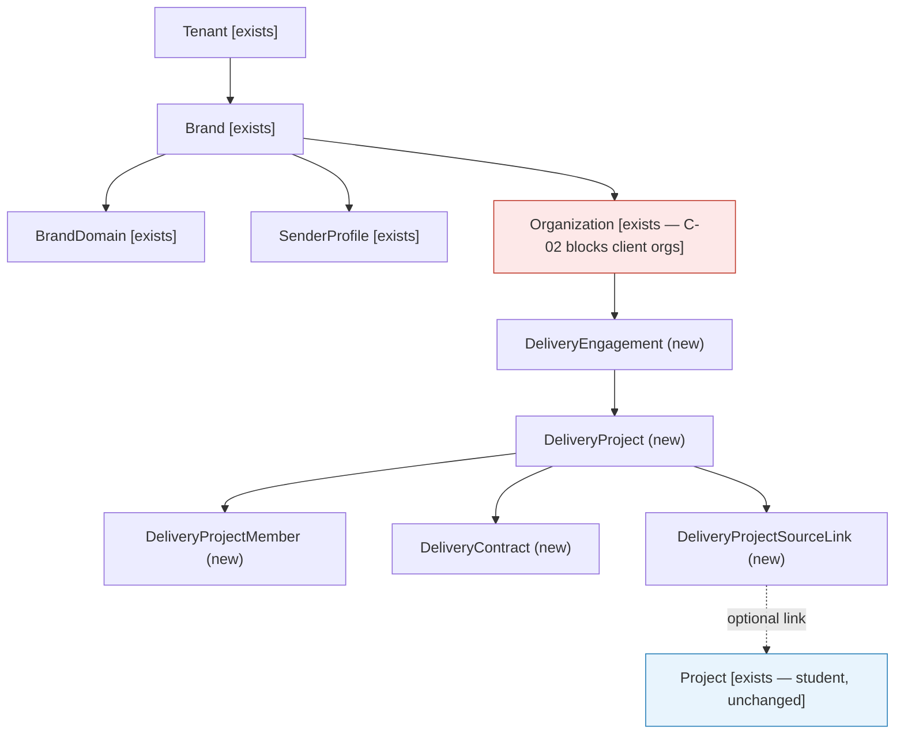

`Organization` is red: it cannot hold a client company until C-02 is resolved, and its
services carry no tenant filter today.

---

## 2. Identity + tenant membership + project membership

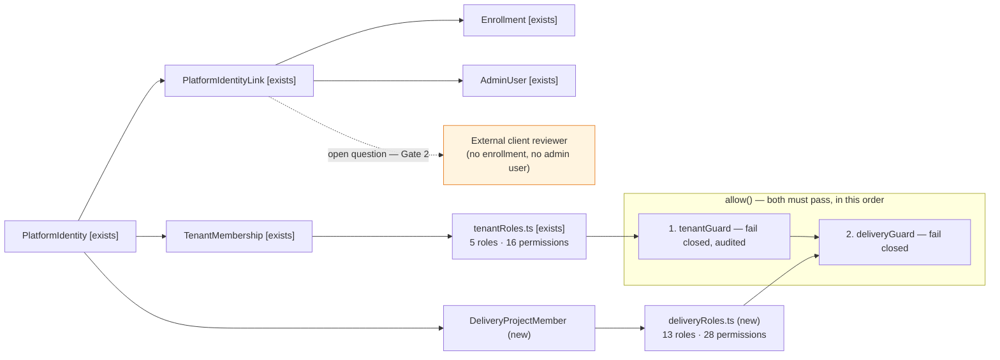

Tenant first, so a foreign caller is denied before the delivery layer discloses whether
the project exists.

---

## 3. Student Project bridge

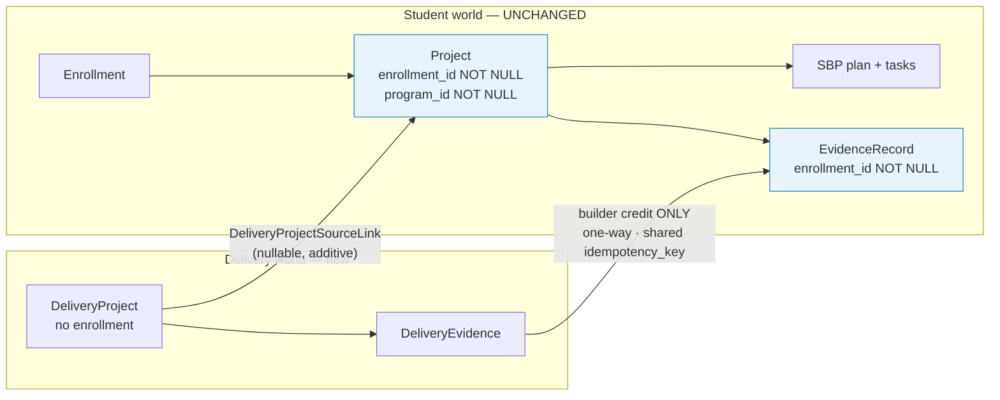

The link is optional and additive. No column is added to `projects`. Evidence flows one
way only.

---

## 4. Project graph

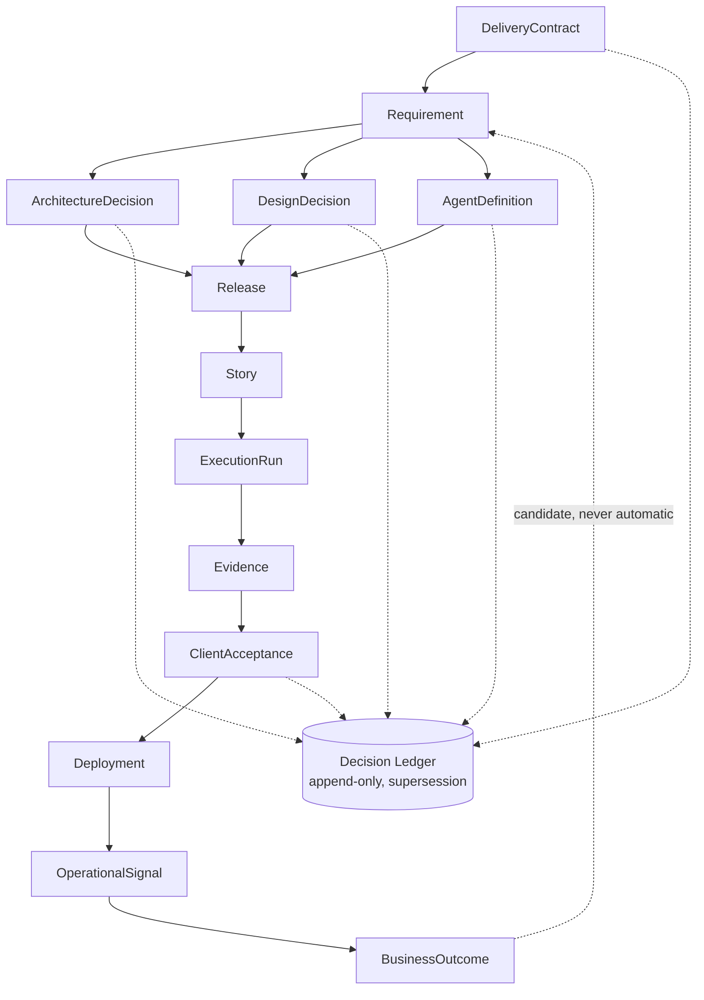

Relational, not a graph database — master plan §Gate 3, and no evidence was found that
relational modelling is inadequate.

---

## 5. Client conversation → decision → story

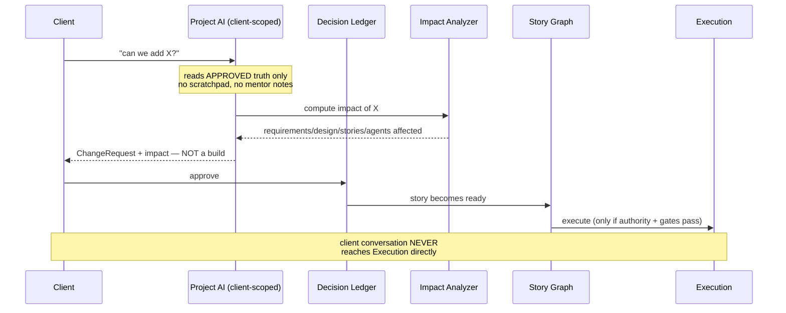

Master plan §5.1. The gap between the client's sentence and a commit is the product.

---

## 6. Design loop

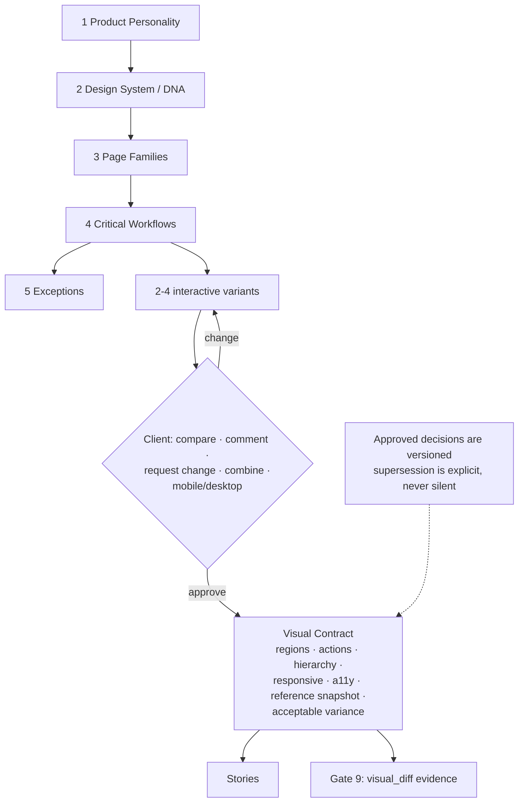

Master plan §24 stop condition: *"design approval can be silently overwritten."*
Supersession is a recorded decision, not an UPDATE.

---

## 7. Trust Before Intelligence

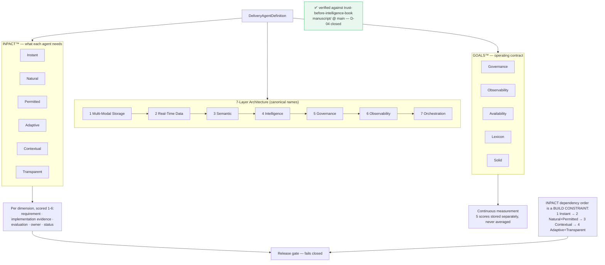

Verified against the canonical book. **INPACT is scored 1–6 per dimension** (36 max,
reported on a 100-point scale); **GOALS is scored 1–5 per dimension** (25 max). The
dependency order is a build constraint, not guidance — a story graph that schedules
Adaptive before Instant is invalid. See
[TRUST_BEFORE_INTELLIGENCE_INTEGRATION.md](TRUST_BEFORE_INTELLIGENCE_INTEGRATION.md).

---

## 8. Execution / sandbox / GitHub

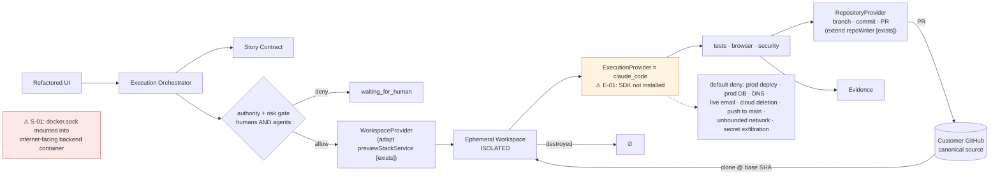

Source custody never moves. Refactored holds pointers and evidence.

---

## 9. Quality OS

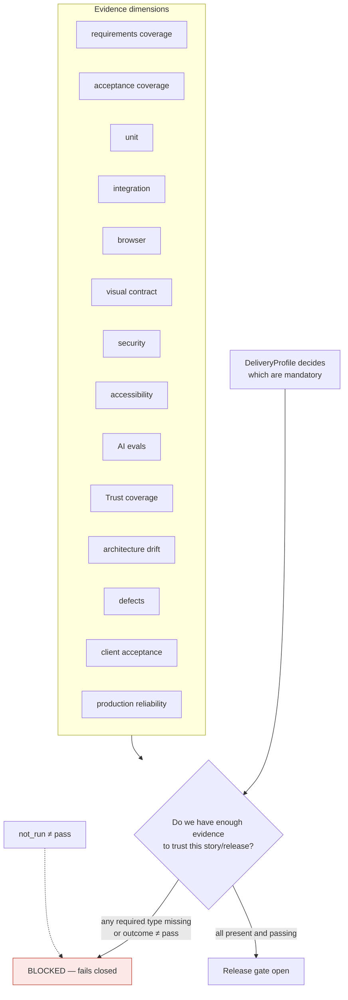

---

## 10. Client acceptance

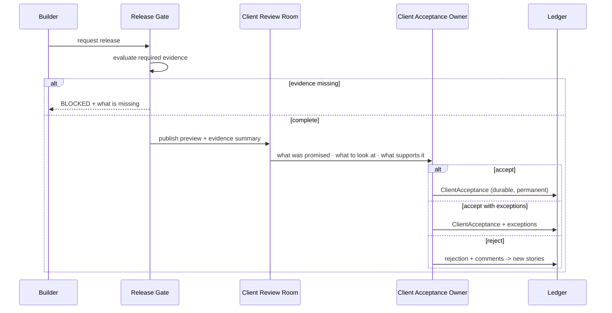

Accept-with-exceptions is a first-class outcome, not a rejection.

---

## 11. Builder / mentor / capacity

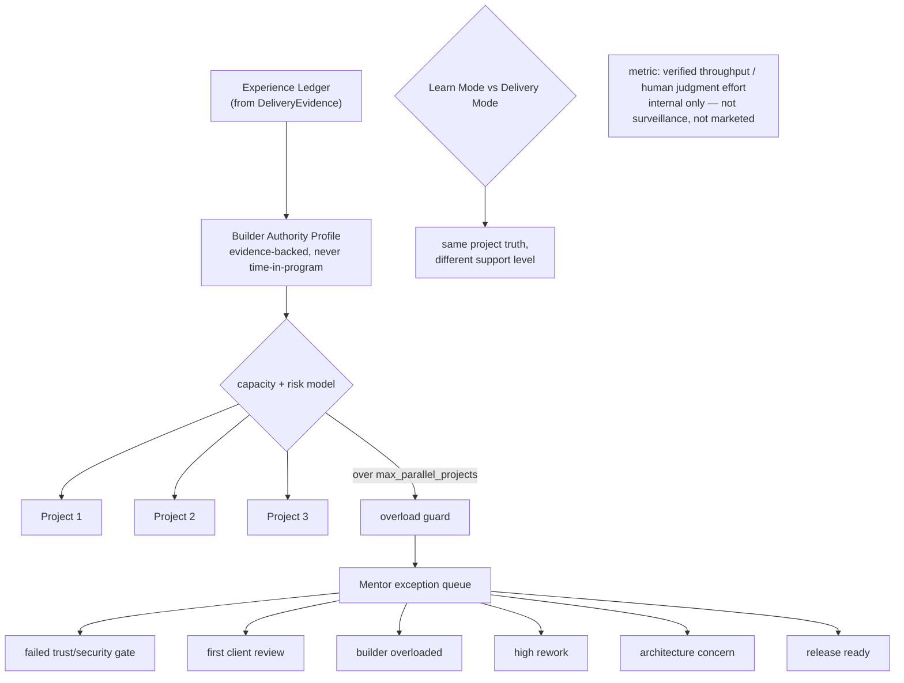

---

## 12. Government profile

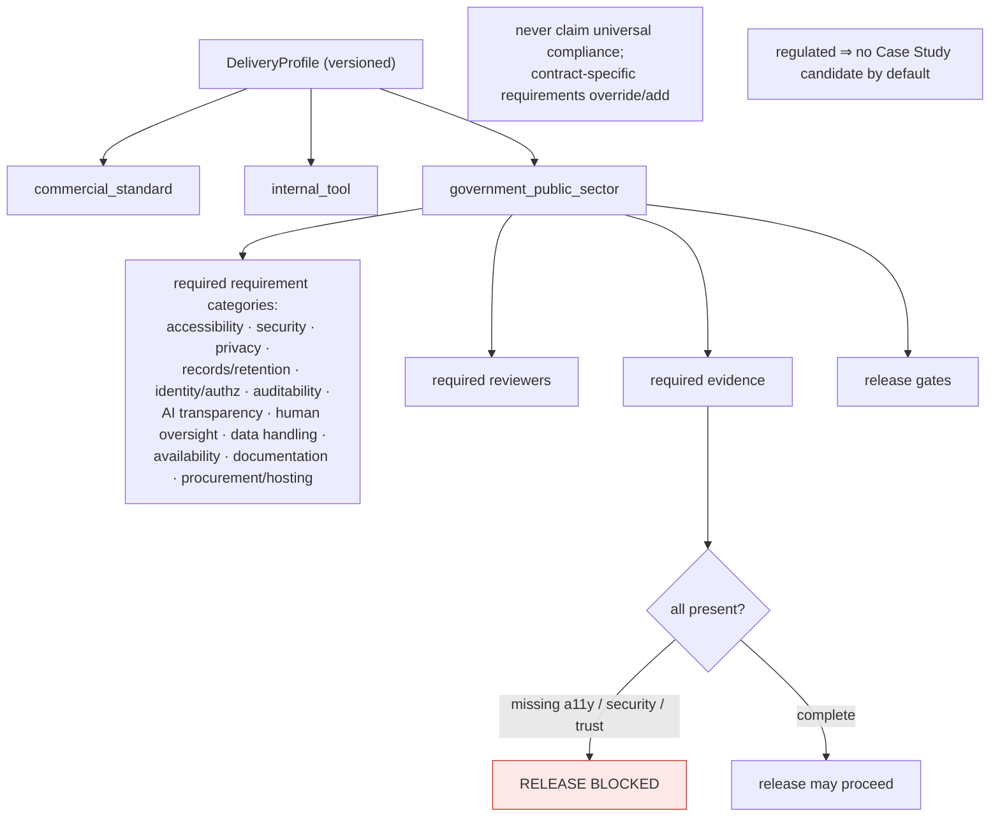

---

## 13. Operate / GOALS feedback

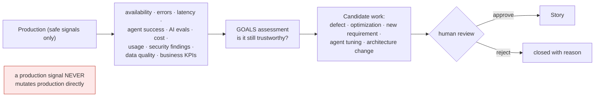

---

## 14. Case Study flow

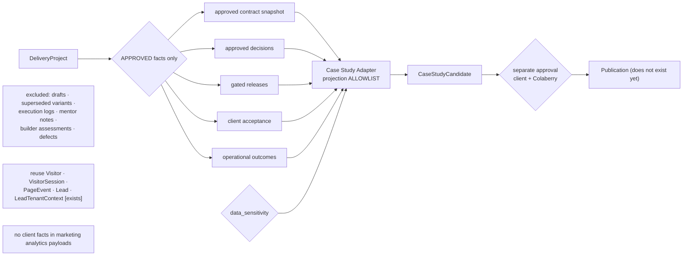

---

## Layering summary

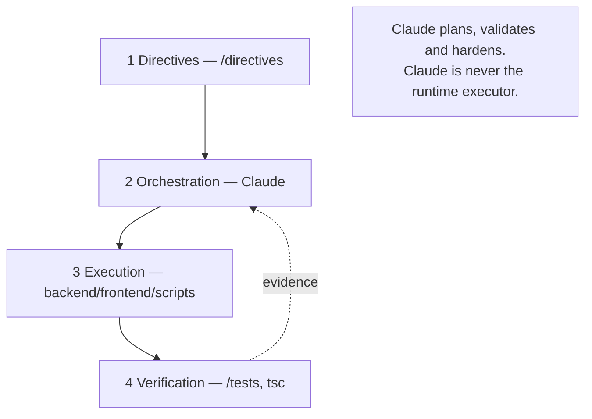

Consistent with root `CLAUDE.md`. The Execution Plane at Gate 8 is a **layer-3
deterministic service** that invokes a coding agent under contract — not Claude Code
acting as the runtime of the business.
