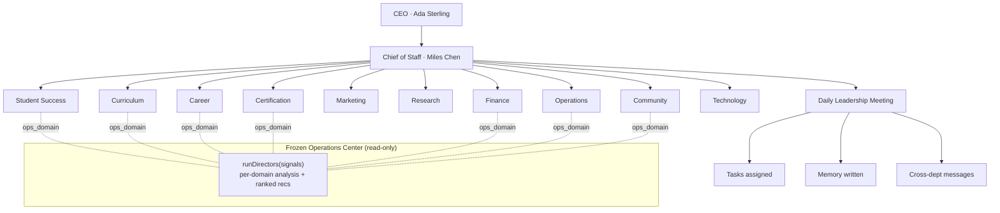

# Phase 5 — AI Workforce Operating System

**Status:** implemented (v1, integrated end-to-end). **Session:** CC-20260708-q7m3. **Date:** 2026-07-09.

The platform now feels like a company: an AI workforce of digital employees that performs meaningful work alongside humans. It **consumes** the frozen platform services (Studio, Composer, Timeline, Runtime, Evidence, Operations Center) — the AI Directors' analyses from the Ops Center become the *brains* of the AI employees, wrapped in a real organization with a Chief of Staff, a daily leadership meeting, tasks, memory, cross-department communication, and performance reviews.

## Organization diagram

## Architecture
`orgRegistry` is the static org chart (code): 12 AI employees (CEO → Chief of Staff → 10 Directors), each with a mission, responsibilities, KPIs, supervisor, and an optional `ops_domain` mapping to a frozen Ops-Center director. `workforceService` is the orchestrator: it convenes the **daily leadership meeting** (idempotent per day) by consuming `gatherSignals → runDirectors → generateBriefing` from the Ops Center, then each director "speaks" (their headline + top recommendation), the top recommendations become **assigned tasks**, every participant's **memory** is written, and cross-department **messages** are sparked. The roster shows live workload (open task count); each employee has an **office** (profile + tasks + memory + messages + a deterministic performance review). The Ops Center is consumed read-only — nothing upstream is modified.

## Theme system
A platform design-token system (`themeKit`) scoped to the Workforce module: **light is the default**, dark is fully supported, every token is a CSS variable, `data-theme="dark"` swaps the palette with **no reload**, and the preference **persists per user** (localStorage). Retrofitting the legacy screens onto these tokens is a separate, deliberately-scoped migration (v2) — freezing/consuming the platform means not redesigning every existing surface.

## Database changes
Four new tables (idempotent `ensureWorkforceSchema`; **no existing table touched**): `workforce_tasks` (the task lifecycle), `workforce_meetings` (permanent daily-meeting record, one per day), `workforce_memory` (per-employee memory), `workforce_messages` (inter-employee communication).

## API changes (admin-auth, `/api/admin/workforce/*`)
| Method | Path | Purpose |
|---|---|---|
| GET | `/roster` | The org + employees + hierarchy + live workload |
| GET | `/employee/:slug` | An employee's office (profile + tasks + memory + messages + review) |
| GET | `/employee/:slug/review` | Performance review |
| GET | `/briefing` | Chief of Staff morning briefing |
| POST | `/meeting/daily` | Run (or fetch) today's leadership meeting — assigns tasks, writes memory, sparks messages |
| GET | `/meetings` | Meeting history |
| GET/POST | `/tasks` · PUT `/tasks/:id` | The task lifecycle |
| GET | `/messages` | Cross-department communication feed |
| GET | `/analytics` | Workforce analytics |

## Frontend
New top-level admin route `/admin/workforce` + nav link. `WorkforceOSPage`: the Chief of Staff briefing (+ School Health), the **daily leadership meeting** (each Director speaks; action items assigned; cross-department notes), the **org roster** (CEO → Chief of Staff → Directors, with live workload; click any employee to open their **office** drawer — mission, responsibilities, KPIs, performance review, tasks, memory), the **workforce communication** feed, and **analytics**. Light-default with an instant **dark-mode toggle**.

## Demonstrated (STOP CONDITION)
An executive opens `/admin/workforce` and observes a functioning AI organization: the Chief of Staff briefs, the daily leadership meeting convenes all Directors (each speaking to their domain from live Ops-Center analysis), recommendations become assigned work, memory persists, departments communicate, and performance is tracked — all supporting the school on top of the existing platform services. Theme switches instantly between light and dark.

## Known limitations (honest, v2)
- **AI Marketplace** (install/export/import new AI employees) is architected (the org is a registry) but the install/import UI is v2.
- **Full human+AI teams / org chart with humans** are represented by the AI hierarchy; blending real staff records is v2.
- **All memory types** (working/long-term/project/relationship separately with search) are collapsed into one memory log v1.
- **Live agent-to-agent conversations** are seeded from findings each standup; a real turn-based inter-agent dialogue is v2.
- **Platform-wide theme retrofit** onto every legacy screen is deferred (the token system + Workforce adoption ship now).
- Marketing/Research/Technology/Admissions directors speak to their mission (no dedicated data source yet); the Ops-mapped directors run on live analysis.

## Production readiness score: **6 / 10**
The STOP-CONDITION workforce is real, integrated, deployed, and observable: a live org that meets, assigns work, remembers, communicates, and is reviewed, on top of the frozen platform. Deductions: marketplace, human+AI blending, richer memory + real agent dialogue, and the platform-wide theme retrofit are v2.
