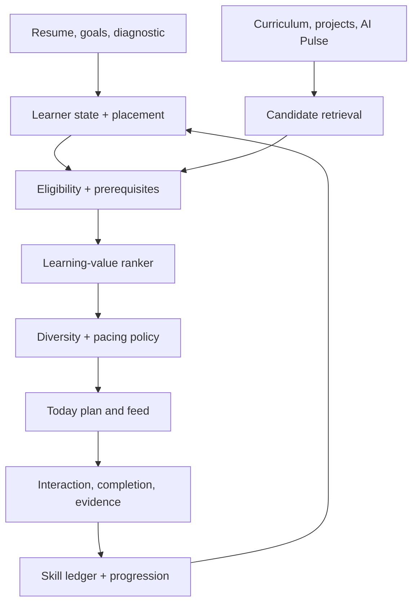

# CAPE — Colaberry Adaptive Path Engine

## Personalized AI learning, field intelligence, and verified progression to AI Architect

**Design status:** Approved for phased build (2026-08-02). Build order: seven phases, executed **one phase at a time** via the `loop-architect` skill — each phase planned, built, quality-gated, deployed, and independently verified in production before the next phase starts.
**Scope:** Onboarding, resume/LinkedIn skill placement, curriculum skill mapping, Classroom progression, Today timeline personalization, Feed Control, and Architecture Skills.
**North-star outcome:** A new learner can start at the right level, learn without being overwhelmed, keep up with the AI field, and steadily produce the evidence required to become an AI Architect.

> Governance note: a minimal settings panel (skill definitions, evidence-band weights) ships alongside Phase 0-1. The full Feed Control governance board — skill coverage heatmap, learner-stage policies, pacing controls, explanation simulator — is Phase 6 scope per the build sequence in §16, since it needs the Phase 0-1 ledger to exist before there is anything real to govern.

---

## 1. Executive decision

Build **CAPE — the Colaberry Adaptive Path Engine** as a layer over the systems already in the repository.

CAPE is not a separate curriculum and not another social feed. It connects five systems that already exist but currently operate with different definitions of progress:

1. The 10-axis **AI Architecture Skills** radar on Today.
2. The 11-domain, evidence-based **competency and promotion engine**.
3. The 50 registered **Curriculum Types** and their per-card content.
4. The **Today Feed V2 / Feed Control** candidate, ranking, cadence, and impression systems.
5. The existing **resume/LinkedIn extraction** in onboarding.

The core product rule is:

> **Optimize the feed for verified progression and useful discovery — not clicks, watch time, streaks, or endless scrolling by themselves.**

Social systems are useful models for retrieval, ranking, diversity, feedback, and exploration. Learning systems add prerequisites, mastery, review, proof, and pacing. CAPE combines both while keeping Colaberry's build-evidence gates intact.

### The two interleaved lanes

Every learner's Today experience blends two distinct lanes:

- **Architect Path:** sequenced concepts, checks, labs, artifacts, projects, and decisions that move the learner toward AI Architect.
- **AI Pulse:** current news, research, tools, videos, architectures, MCP developments, and market intelligence that keep the learner current.

The learner sees one coherent feed, but the engine never confuses "I read a current article" with "I proved I can architect a system."

---

## 2. What the repository already has

The proposed system extends the current architecture rather than replacing it.

| Current capability | What is working | Gap CAPE closes |
|---|---|---|
| Today Feed V2 | Append-only impressions, infinite pagination, anchored + ambient sources, provider rotation, interaction history | Ranking is not driven by learner skill gaps, prerequisite readiness, goals, difficulty fit, or daily learning load |
| Feed Control | Surface routing, Today eligibility, cadence, caps, cooldown, recency, priority, exploration, student simulation | No skill coverage matrix, learner-stage policy, learning-objective score, or "why this advances this learner" explanation |
| Architecture Skills radar | 10 clear public-facing AI Architect axes | It is currently calculated in the browser from completed/available card counts and a hardcoded type map — not from a durable skill ledger |
| Progression engine | Evidence records, Learning/Builder/Community XP, competency confidence, promotion gates, anti-gaming separation | Uses 11 different competency domains and does not accept resume placement or passive learning as verified build evidence |
| Resume/LinkedIn ingest | Extracts role, seniority, skills, maturity, background, and profile fields; awards the existing one-time setup points | Extracted skills are stored for personalization but do not become versioned, explainable Architecture Skill claims |
| Curriculum Type registry | 50 types with surface, bucket, XP, difficulty, competency defaults, evidence flags, and render bands | No required mapping from every type/card/blueprint to the 10 Architecture Skills, prerequisites, or credit strength |
| Curriculum | Week 0-12 blueprint, Classroom card flow, intensive builds, Architect Mindset, and ten AI intelligence pipelines | RAG and Vectors are materially thinner than Agents/MCP, Prompting, Governance, and System Design in the visible 10-axis model |

### Important current-state correction

The Today page's **Readiness** ring is still hardcoded to `0/100`, while the radar uses an in-browser ratio. CAPE should make both derive from one backend learner-skill profile. The public radar and the real promotion engine may remain different views, but they must share traceable evidence and an explicit crosswalk.

Repository references: [Today shell](https://github.com/ColaberryIntern/ColaberryEnterprise_AI_LeadershipAccelerator/blob/main/frontend/src/pages/portal/today/TodayShell.tsx), [Architecture Skills radar](https://github.com/ColaberryIntern/ColaberryEnterprise_AI_LeadershipAccelerator/blob/main/frontend/src/pages/portal/SkillMeter.tsx), [resume ingest](https://github.com/ColaberryIntern/ColaberryEnterprise_AI_LeadershipAccelerator/blob/main/backend/src/services/resumeIngestService.ts), [type registry](https://github.com/ColaberryIntern/ColaberryEnterprise_AI_LeadershipAccelerator/blob/main/backend/src/services/timeline/typeRegistry.ts), [progression service](https://github.com/ColaberryIntern/ColaberryEnterprise_AI_LeadershipAccelerator/blob/main/backend/src/services/progression/progressionService.ts), [Today feed composer](https://github.com/ColaberryIntern/ColaberryEnterprise_AI_LeadershipAccelerator/blob/main/backend/src/services/timeline/todayFeedComposer.ts), and [Feed Control](https://github.com/ColaberryIntern/ColaberryEnterprise_AI_LeadershipAccelerator/blob/main/backend/src/services/timeline/feedControlService.ts).

---

## 3. The canonical 10-skill Architecture Skill Graph

Keep the 10 axes already visible to learners. Make them backend-owned, versioned, and expandable into subskills.

| Skill axis | What it means at architect level | Current curriculum anchors |
|---|---|---|
| LLM Core | Model behavior, limits, tokens/context, structured output, model selection, cost/latency tradeoffs | Week 0 foundations, Week 3 API, research/news explainers |
| Prompting | Reusable prompt design, testing, versioning, decomposition, prompt systems | Weeks 3-4, Prompt Labs/Challenges |
| RAG | Retrieval design, chunking, grounding, citations, freshness, evaluation | Week 4 course segment, Deep Dives, architecture breakdowns |
| Vectors | Embeddings, vector stores, similarity, hybrid retrieval, indexing tradeoffs | Week 4 course segment; requires stronger dedicated coverage |
| Agents & MCP | Tool use, agents, skills, subagents, MCP servers, coordination, boundaries | Weeks 1-2 and 5-8 |
| Eval & Guardrails | Evals, quality gates, safety, reliability, abstention, escalation, red-team thinking | Weeks 3, 8-10, knowledge checks, evaluations |
| System Design | Boundaries, data flow, orchestration, patterns, tradeoffs, architecture decisions | Architect Mindset, Weeks 6-12 |
| Context Engineering | Context selection, memory, instructions, retrieval, compacting, state | Weeks 1-4 and agent/MCP work |
| Governance | Access, privacy, audit, HITL, authority, risk, ownership | Weeks 9-12 and Architect Mindset |
| Deploy & Ops | Testing, CI/CD, observability, secrets, deployment, reliability, cost and incident response | Weeks 6, 8-12 |

Each axis may later contain subskills, but Today continues showing ten understandable dimensions. Example: `rag` contains `chunking`, `retrieval`, `grounding`, `citations`, and `rag_evaluation`.

### Crosswalk to the existing 11 promotion competencies

Do not delete the current competency ladder. It protects the meaning of AI Builder and AI Architect. Add a crosswalk:

| Architecture Skill | Existing promotion competencies commonly related |
|---|---|
| Prompting | prompt_engineering |
| Context Engineering | context_engineering |
| System Design | architecture, documentation, leadership |
| Eval & Guardrails | testing, debugging, security |
| Governance | security, leadership, communication, documentation |
| Deploy & Ops | deployment, testing, debugging, github |
| Agents & MCP | architecture, context_engineering, deployment |
| LLM Core / RAG / Vectors | New learning axes; verified artifacts crosswalk to architecture, testing, or context_engineering based on actual evidence |

Only **verified Application or Judgment evidence** may be translated into the current `EvidenceRecord`/promotion engine. Resume claims and content consumption never promote someone to AI Builder or AI Architect.

---

## 4. One learner profile, two scores

CAPE keeps two different numbers because they answer different questions.

### A. Placement score

**Question:** What is this person likely ready to see next?

Inputs:

- Resume/LinkedIn evidence
- A short adaptive diagnostic
- Role, industry, goal, and years of experience
- "Already know this," "too easy," and "too advanced" feedback
- Recent successful and failed activities

Placement may move a person past beginner explanations. It does not certify mastery.

### B. Verified proficiency

**Question:** What has this person actually demonstrated inside the system?

Inputs:

- Completed and passed assessments
- Validated Classroom assignments
- Submitted artifacts and GitHub evidence
- AI/instructor review
- Architecture decisions and tradeoff explanations
- Capstone and production-shaped evidence

Verified proficiency drives the solid radar, Architect Readiness, Builder promotion, and Architect promotion.

### The radar should show both

- **Dotted/translucent polygon:** resume + diagnostic placement.
- **Solid polygon:** verified Colaberry proficiency.
- Tooltip: "Resume-indicated 52 · verified 18 · next proof: complete the Week 5 MCP lab."

This makes prior experience visible without letting a keyword-filled resume manufacture credentials.

---

## 5. Resume and LinkedIn placement process

### If no resume is uploaded

- Create ten zero-valued provisional skill states.
- Place the learner in **Foundation mode**.
- Start with "What is AI?", "How generative AI works," "What AI can and cannot do," "Prompt vs AI system," and "What an AI Systems Architect builds."
- No penalty or warning language; the experience simply starts from first principles.

### If a resume/LinkedIn PDF is uploaded

Extend the existing extractor to return structured skill claims:

```json
{
  "skill_claims": [
    {
      "skill_id": "agents_mcp",
      "subskills": ["tool_use", "agent_workflows"],
      "evidence_text": "Built an automated claims workflow using LLM tools...",
      "evidence_kind": "project_outcome",
      "recency_years": 1,
      "ownership": "built",
      "scope": "production",
      "confidence": 0.82
    }
  ]
}
```

The mapper should distinguish:

- Keyword in a skills list
- Used in a job bullet
- Built or owned a system
- Produced a measurable outcome
- Operated it in production
- Led architecture/governance decisions

### Provisional-credit rules

- Resume claims seed **placement**, not promotion.
- A skills-list keyword earns less than an outcome-bearing project bullet.
- Recent, repeated evidence earns more than a single old mention.
- Resume-only contribution to any displayed verified skill is capped at zero; its visible contribution lives in the dotted placement polygon.
- Resume re-upload creates a new version and supersedes prior claims. It never double-awards.
- Each claim preserves source provenance and the extractor version so an admin can explain or correct it.

### Adaptive confirmation

Do not force a long placement test. Give a 6-10 minute challenge only for the strongest resume claims:

1. One recognition/knowledge item.
2. One scenario/tradeoff item.
3. Optionally, one tiny proof task for a claimed advanced skill.

Outcomes:

- **Confirmed:** advance placement and compress matching foundations.
- **Partially confirmed:** show a short bridge lesson plus a practice item.
- **Not confirmed:** return the skill to foundation sequencing without shaming the learner.

"Test out of this" remains available on introductory cards.

---

## 6. Skill credit model

Every skill has four independently scored evidence bands:

| Band | Contribution to proficiency | Typical sources |
|---|---:|---|
| Claim | 20% | Resume/LinkedIn, self-report, diagnostic placement |
| Knowledge | 25% | Videos, readings, Deep Dives, quizzes, retrieval reviews |
| Application | 35% | Labs, artifacts, GitHub, implementations, demonstrations |
| Judgment | 20% | Architect Mindset, ADRs, tradeoff analysis, governance decisions, evaluated presentations |

The public proficiency for a skill is:

```text
proficiency = 0.20 × claim
            + 0.25 × knowledge
            + 0.35 × application
            + 0.20 × judgment
```

Within each band, repeated identical activities have diminishing returns. Old unreinforced knowledge schedules a review; it does not silently erase a verified build.

### Credit speed by source

| Signal | Typical skill credit | Verification | Rule |
|---|---:|---|---|
| Click/open/dwell only | 0 | None | Useful ranking signal, never skill proof |
| Completed Timeline video/article/podcast | 1-2 | Completion gate | Slow Knowledge growth; daily/topic caps |
| Timeline quick check passed | 3-5 | Scored | Faster Knowledge growth |
| Classroom lesson completed | 2-4 | Completion | Moderate Knowledge growth |
| Classroom assessment passed | 6-10 | Scored | Strong Knowledge/Judgment signal |
| Classroom lab or artifact | 10-20 | AI or rule validation | Fast Application growth |
| GitHub-backed implementation | 15-25 | Evidence validation | Strong Application growth |
| Instructor-approved architecture work | 15-25 | Human validation | Strong Application/Judgment growth |
| Capstone/architecture package | 20-30 | Multi-part review | Highest-strength evidence across mapped skills |
| Community attendance/streak/system badge | 0 | None | Engagement points may still apply; no Architecture Skill credit |
| Accepted community demo/review | 3-10 | Evidence required | Credit only when mapped proof exists |

When an item maps to several skills, its credit is distributed by weights that total 1.0. A person cannot farm a single easy card type to fill the entire radar.

---

## 7. Required curriculum-to-skill contract

Every authorable Curriculum Type must declare a default Architecture Skill impact before it can be approved in Experience Studio.

```ts
interface ArchitectureSkillImpact {
  skill_id: string;
  weight: number;              // all impacts total 1.0
  bands: Array<'claim'|'knowledge'|'application'|'judgment'>;
  credit_strength: 'none'|'low'|'medium'|'high'|'capstone';
  evidence_required: boolean;
  max_credit: number;
}

interface LearningPlacementContract {
  skill_impacts: ArchitectureSkillImpact[];
  prerequisite_skills: Array<{ skill_id: string; min_placement: number }>;
  recommended_range: { min: number; max: number };
  freshness_days?: number | null;
  reviewable: boolean;
}
```

### Resolution hierarchy

One type default is not enough: a Deep Dive about RAG is different from a Deep Dive about governance. Resolve mappings in this order:

1. **Card override** — exact learning object.
2. **Week/blueprint mapping** — curriculum intent for that week.
3. **Curriculum Type default** — general behavior.
4. **AI-suggested draft** — only as an authoring aid; a human approves it.

At publish time, stamp the resolved mapping and version onto the Timeline Card. Later mapping edits do not rewrite historical evidence silently.

### Default policies for all 50 registered types

| Policy group | Current type slugs | Default skill behavior |
|---|---|---|
| Orientation and light exposure | `announcement`, `video`, `testimonial`, `podcast`, `blog`, `warmup`, `deep_dive`, `anthropic_skills_jar` | Low Knowledge credit after a real completion gate; exact skill comes from card/blueprint |
| Intelligence / AI Pulse | `ai_news_flash`, `ai_research_digest`, `ai_tool_of_the_day`, `ai_video_stream`, `ai_quote_of_the_day`, `ai_architecture_breakdown`, `build_breakdown`, `mcp_server_spotlight`, `claude_code_technique`, `market_intelligence` | Low Knowledge credit, freshness expiry, source-quality score, exact skill tags; currentness does not equal mastery |
| Checks and evaluated learning | `knowledge_check`, `survey`, `question`, `evaluation`, `certification_exercise` | Medium Knowledge/Judgment credit only from valid submitted/scored responses |
| Prompt/build/application | `prompt_lab`, `prompt_challenge`, `implementation_task`, `setup_lab`, `artifact_submission`, `project_task`, `build_story`, `internship_activity` | High Application credit; require evidence for meaningful growth |
| Judgment and communication | `reflection`, `architect_mindset`, `ai_video_feedback`, `mock_interview`, `presentation`, `demo` | Judgment plus the exact mapped skill; higher credit only after AI/instructor/rubric validation |
| Community practice | `discussion`, `community_discussion`, `study_session`, `community_live_session` | Normally zero/low skill credit; meaningful reviewed contribution may create evidence |
| Delivery events | `live_class`, `event`, `demo_tuesday`, `kes_wednesday`, `marketing_friday` | Event attendance itself gives no Architecture Skill credit; activities delivered within the event may |
| System/gamification | `milestone`, `achievement`, `daily_streak`, `completion_badge` | Zero skill credit; these reflect progress rather than create it |

---

## 8. Curriculum coverage across Week 0-12

| Week | Main curriculum intent | Primary Architecture Skills |
|---:|---|---|
| 0 | Free AI Preview: what AI is, what it can do, prompt vs system, architect path | LLM Core, Prompting |
| 1 | Claude Code foundations, agentic loop, context, CLAUDE.md, workspace | Agents & MCP, Context Engineering, Deploy & Ops |
| 2 | Build and troubleshoot Agent Skills | Agents & MCP, Context Engineering, Governance |
| 3 | Claude API, tools, structured output, eval, workflow assistant | LLM Core, Prompting, Agents & MCP, Eval & Guardrails |
| 4 | Prompt engineering, prompt library, retrieval segment | Prompting, Context Engineering, Eval & Guardrails, RAG |
| 5 | MCP foundations and first MCP server | Agents & MCP, Context Engineering, System Design |
| 6 | Advanced MCP, transports, integration, scaling | Agents & MCP, System Design, Governance, Deploy & Ops |
| 7 | Subagents and coordinated multi-agent team | Agents & MCP, System Design, Context Engineering |
| 8 | Claude Code workflows, hooks, headless automation, CI review | Deploy & Ops, Agents & MCP, Eval & Guardrails, Governance |
| 9 | Reliability engineering and quality layer | Eval & Guardrails, Deploy & Ops, System Design, Governance |
| 10 | ABAC, HITL, audit, decision authority | Governance, Eval & Guardrails, System Design |
| 11 | Seven-layer architecture, trust boundaries, ADRs, scorecards | System Design, Governance, Deploy & Ops |
| 12 | Integrated capstone, Architect Expo, certification gate | All ten; strongest in System Design, Governance, Eval, Deploy & Ops |

### Curriculum gap to address

The current program is very strong in Agents/MCP, Prompting, System Design, Governance, and Deploy/Ops. The visible radar promises comparable growth in **RAG and Vectors**, but those areas currently depend heavily on a Week 4 segment and optional content.

Add a small **Data & Retrieval pathway** that can appear through Week 3-6 Timeline cards without changing the 12-week spine:

1. Embeddings and similarity in plain language.
2. Vector database lab.
3. Chunking and hybrid retrieval.
4. Grounded answers and citations.
5. RAG evaluation and freshness.
6. Architecture tradeoff: RAG vs long context vs fine-tuning vs tools.

This prevents the radar from becoming visually balanced while the underlying curriculum is not.

---

## 9. Recommendation architecture



### Stage 1 — candidate retrieval

Use the current one-way aggregation model:

- Classroom cards
- Project tasks
- Community/live sessions
- AI Pulse intelligence cards
- Ambient blogs, podcasts, and testimonials
- Review cards generated from prior learning

### Stage 2 — hard eligibility

An item cannot rank if it fails:

- Entitlement and access
- Publish/release window
- Cohort/week gates
- Required prerequisite skill
- Already completed/dismissed policy
- Frequency/cooldown policy
- Source-quality or freshness threshold
- Available time/modality constraints when the learner set them

Resume placement may compress optional foundations. It must never bypass paid access, cohort release dates, required Classroom submissions, or promotion gates.

### Stage 3 — explainable learning-value score

Start rule-based and transparent:

```text
score = 0.30 × skill-gap fit
      + 0.20 × prerequisite/sequence fit
      + 0.15 × learner goal, role, and industry fit
      + 0.10 × evidence-balance need
      + 0.10 × freshness/field importance
      + 0.05 × time and modality fit
      + 0.05 × momentum/continuation value
      + 0.05 × live/community urgency
      - fatigue, repetition, mismatch, and quality penalties
```

**Evidence-balance need** is critical: if a learner has consumed many videos but built nothing, the engine should increase labs and proof tasks instead of feeding more passive content.

### Stage 4 — policy reranking

Apply non-negotiable feed constraints after scoring:

- No more than two items of the same type consecutively.
- No more than two passive items before a check, reflection, or action.
- Reserve a small exploration percentage — use the existing 15% default as the starting point.
- Never show more than one stretch item in the first five positions after a recent failure.
- Insert spaced review when a skill's `next_review_at` arrives.
- Preserve urgent Classroom deadlines and live sessions.
- Prevent one popular skill, source, or content format from crowding out the path.

### Stage 5 — explanation

Every served card stores its score, policy version, learner-state version, and human-readable reasons in the existing impression record:

- "Builds your Agents & MCP gap."
- "Required before your Week 5 lab."
- "12 minutes — fits your daily target."
- "Current AI update related to Governance."
- "Review due: you last practiced this 9 days ago."

---

## 10. Pacing: infinite discovery, finite daily expectations

The Today feed may remain bottomless, but the learner must never feel that the whole feed is homework.

### Today Plan

Place a finite **Today Plan** before the browse feed:

1. **Next Best Learning Action** — exactly one primary recommendation.
2. One foundation or bridge item.
3. One practice/check/build item.
4. One current AI Pulse item.
5. One review, community, or live item.

Default plan: approximately 20 minutes for a free learner. A cohort learner's plan includes time-sensitive Classroom work and may be longer based on the active week.

After those items, label the infinite section **Explore more**. Scrolling is optional; it does not imply unfinished work.

### Lifecycle mixes

| Learner mode | Recommended first-screen mix |
|---|---|
| Foundation / no resume | 60% foundation, 15% guided practice, 15% AI Pulse/motivation, 10% community/exploration |
| Experienced cold start | 30% bridge/diagnostic, 35% skill-gap learning, 20% AI Pulse, 15% exploration/community |
| Active Builder | 35% Classroom/project, 25% targeted learning, 15% review, 15% AI Pulse, 10% community |
| Architect track | 30% advanced builds/design review, 25% AI Pulse, 20% weak-skill closure, 15% governance/operations, 10% community leadership |
| Returning after absence | One gentle restart, one review, one next action; do not dump the entire backlog first |

---

## 11. Today page design

Preserve the command-center layout in the provided Today screenshot, but make each element functional and connected.

### Command band

- Keep Points, Setup, Next Tier, streak, phone, and upcoming items.
- Replace hardcoded Readiness with backend `architect_readiness`.
- Show "Resume baseline added" as an onboarding event, not as points promotion.

### AI Architecture Skills radar

- Backend-owned ten-skill state.
- Dotted placement polygon + solid verified polygon.
- Clicking an axis opens a right panel with:
  - current placement and verified level;
  - evidence history;
  - what the learner already completed;
  - the next recommended proof;
  - "Practice this skill" and "Test out" actions.

### Timeline header

- Replace zero-value category chips with live counts.
- Default remains **All**; chips filter without resetting progress.
- Add `My Path`, `AI Pulse`, `Classroom`, `Projects`, `Community`, and `Review` as meaningful views.

### Card treatment

Add three compact chips:

- **Why this:** skill gap / prerequisite / current / review.
- **Level:** Foundation, Working, Stretch, Architect.
- **Proof:** Learn, Check, Build, or Decide.

Add learner controls:

- More like this
- Less like this
- Already know this
- Too easy
- Too advanced
- Not interested
- Test out

These become ranking signals. "Already know this" alone does not award skill credit.

---

## 12. Orchestration and Feed Control design

Keep the current orchestration flow — Composer → Experience Studio → Timeline → Feed Control — and add the required controls at the correct stage.

### Experience Studio

Add a required **Architecture Skill Contract** section:

- Default skill impacts and weights
- Evidence bands
- Credit strength and cap
- Prerequisites
- Recommended proficiency range
- Freshness/expiry
- Completion signal
- "No skill credit" is a valid, explicit selection

Approval is blocked when the mapping is missing or invalid.

### Curriculum Composer

Add a ten-axis **coverage meter by week**:

- Target coverage from the Week Blueprint
- Actual coverage from scheduled cards
- Knowledge/Application/Judgment balance
- Warnings for over-concentration or gaps
- Special warning when a skill has only passive content and no proof task

### Timeline editor

Add card-level override:

- Skill mapping
- Prerequisite
- Difficulty range
- Proof type
- Estimated time
- Freshness date

Show the resolved source: `card override`, `week blueprint`, or `type default`.

### Feed Control — governance panel (Phase 6)

Extend the current board and simulator with four panels:

1. **Skill coverage heatmap:** 50 types × 10 Architecture Skills.
2. **Learner-stage policies:** Foundation, Experienced Cold Start, Builder, Architect, Returning.
3. **Pacing controls:** daily plan size, passive-to-active ratio, stretch cap, review share, AI Pulse share.
4. **Explanation simulator:** for a chosen student, show placement, top gaps, candidates removed by prerequisites, final score breakdown, and reranking reasons.

Add simulator personas:

- New learner, no resume
- New learner, experienced resume
- Active Week 5 learner
- Returning learner
- Near-Architect learner

**Phase 0-1 minimal settings panel:** a lighter admin surface ships early, scoped to what exists that soon — skill definitions (name, description, axis order) and evidence-band weights (claim/knowledge/application/judgment percentages, currently 20/25/35/20 per §6). This is not the Feed Control board; it is the smallest adjustable surface over the Phase 0-1 ledger, so the design is governable from day one instead of hardcoded.

### Analytics

Report learning value rather than feed addiction:

- Time to first meaningful completion
- Verified skill growth per active week
- Skill-gap closure rate
- Passive-to-build ratio
- Review retention
- Classroom assignment completion
- "Too easy / too advanced" rate
- Duplicate and stale-content rate
- Free-to-paid conversion as a business outcome, not the ranker's primary objective

---

## 13. Data model

### New tables

| Table | Purpose |
|---|---|
| `architecture_skill_definitions` | Versioned ten axes and future subskills |
| `architecture_skill_aliases` | Resume/content terms mapped to canonical skills |
| `architecture_skill_prerequisites` | Skill graph and minimum placement requirements |
| `curriculum_skill_maps` | Type, blueprint, or card mapping with bands, weight, strength, caps, and version |
| `resume_skill_claims` | Versioned provisional claims with source evidence, recency, ownership, and extractor version |
| `student_skill_evidence` | Append-only skill events from resume, diagnostic, Timeline, Classroom, GitHub, review, and capstone |
| `student_architecture_skill` | Derived per-skill placement, four evidence-band scores, proficiency, confidence, and next review |
| `learner_recommendation_profile` | Goal, role/industry, time budget, modality, lifecycle mode, and state version |

### Extensions to existing structures

- `curriculum_type_definitions`: add/relate the Architecture Skill Contract.
- `timeline_cards`: stamp resolved skill mapping + mapping version at publish.
- `today_feed_impressions`: add rank score, reason list, policy version, and learner-state version.
- `onboarding_profiles`: retain resume version and extraction version.
- `EvidenceRecord`: accept only crosswalked, verified Application/Judgment evidence from CAPE.

### Idempotency

- Resume: `resume:<profile_version>:<skill_id>`
- Diagnostic: `diagnostic:<attempt_id>:<skill_id>`
- Timeline completion: `timeline:<enrollment_id>:<card_id>:<skill_id>`
- Classroom evidence: `classroom:<submission_id>:<skill_id>`
- GitHub evidence: existing stable commit/PR references plus skill id
- Mapping edits create a new mapping version; they never double-replay historical credit

All learner skill state is recomputed from the append-only ledger, following the current competency engine's drift-resistant approach.

---

## 14. Example learner journeys

### Journey A — no resume, true beginner

1. Account created; all ten placement axes begin at zero.
2. Today shows: "What is AI?" → "How an LLM produces an answer" → first prompt → 3-question check → "What an AI Architect builds."
3. The learner completes a 15-minute plan. LLM Core and Prompting gain small Knowledge evidence.
4. The next visit introduces limitations, grounding, and prompt refinement — not agents, vectors, governance, and deployment all at once.
5. After success, the feed gradually opens the wider Week 0 and AI Pulse inventory.

### Journey B — experienced resume

1. Resume indicates Claude API, RAG, cloud deployment, and architecture ownership.
2. Dotted radar shows provisional placement; verified radar remains low.
3. An 8-minute diagnostic confirms LLM Core and RAG but exposes an Agents/MCP gap.
4. Beginner material becomes optional 2-minute bridges; the primary recommendation becomes "MCP boundaries and tool contracts."
5. A "Prove your RAG experience" mini-artifact can establish verified Application credit.

### Journey C — active Classroom learner

1. The learner watches two Timeline explainers: slow Knowledge growth.
2. The learner completes the Week 5 MCP lab with validated GitHub evidence: fast Agents/MCP and System Design Application growth.
3. The feed stops repeating MCP foundations, offers advanced transport/integration material, and schedules a later retrieval review.
4. A fresh MCP registry update appears through AI Pulse because it matches both the learner's skill and current week.

---

## 15. Safety, fairness, and anti-gaming rules

- Resume text is untrusted input and provisional evidence.
- Resume absence never lowers status or access.
- Protected traits, names, contact information, and exact employer names do not enter ranking features.
- Placement uses normalized role/industry/skill signals, not prestige signals.
- Opens, clicks, scrolling, and streaks cannot generate Architecture Skill proof.
- Passive content alone cannot reach Builder or Architect.
- Repeated easy items have diminishing returns and source caps.
- AI evaluation must store rubric, score, evidence, model/version, and retry history.
- High-stakes promotion remains evidence-gated and human/AI reviewable.
- Every recommendation and every skill credit is explainable and reversible by an authorized admin.

---

## 16. Build sequence

Each phase below is its own `loop-architect` run: discover → plan → independently audited plan → execute task-by-task with fresh-evidence verification → quality gate → deploy → independently verified live → plain-English handoff. A phase is not started until the prior phase's production verification is clean.

### Phase 0 — align definitions

- Approve the ten-skill ontology and public descriptions.
- Approve the crosswalk to the 11 promotion competencies.
- Approve source credit strengths and caps.

### Phase 1 — durable skill ledger, radar, and minimal settings panel

- Add skill definitions, maps, evidence, and derived learner state.
- Replace the in-browser radar calculation.
- Make Readiness dynamic.
- Render placement vs verified polygons.
- Ship the minimal settings panel (skill definitions + evidence-band weights) described in §12.

### Phase 2 — resume placement

- Extend resume extraction with evidence-backed skill claims.
- Add versioning/supersession.
- Add short adaptive diagnostic and "Test out."

### Phase 3 — curriculum mapping

- Add the Architecture Skill Contract to Experience Studio.
- Map all 50 current types.
- Add week targets and card-level overrides.
- Backfill current published cards with reviewed mappings.

### Phase 4 — learning-value ranker

- Add learner state, candidate features, explainable score, prerequisite filter, evidence-balance signal, and lifecycle policy.
- Reuse current impressions, caps, cooldowns, surface aggregation, and simulator.

### Phase 5 — Today Plan and learner controls

- Add finite Today Plan before Explore More.
- Add "Why this," level, proof type, and feedback controls.
- Add meaningful filters/counts and skill detail drawer.

### Phase 6 — coverage and quality operations, full governance panel

- Add the full Feed Control governance board (heatmap, learner-stage policies, pacing controls, explanation simulator) described in §12.
- Add simulation personas.
- Add RAG/Vectors pathway.
- Add content freshness, source-quality, and expiry policies to AI Pulse.

### Phase 7 — experimentation, then ML if justified

Start with the transparent rule-based score. After enough clean outcome data exists, an ML ranker may predict meaningful completion or gap closure behind the same interface. Keep policy reranking, prerequisites, evidence rules, and explanations outside the model.

---

## 17. Acceptance criteria

1. A learner with no resume starts at Foundation and sees "What is AI?" content in the first session.
2. A resume upload creates versioned provisional claims without awarding Builder evidence.
3. Re-uploading the same or updated resume never doubles skill credit.
4. Every approved Curriculum Type has a valid Architecture Skill Contract or explicit zero-credit declaration.
5. Every published card exposes its resolved skill mapping and mapping source.
6. A validated Classroom lab grows mapped skills materially faster than a Timeline reading.
7. Click/dwell/streak/system-badge events produce zero Architecture Skill evidence.
8. The first five recommendations respect prerequisite, diversity, passive/active, and stretch limits.
9. Feed Control can simulate a specific learner and explain every inclusion, exclusion, score, and rerank.
10. The Today radar and Readiness ring come from backend learner state, not hardcoded frontend math.
11. RAG and Vectors each have at least one foundation, one check, one applied task, and one architect-level decision activity.
12. Points, Learning XP, Builder XP, Community XP, Architecture Skills, and promotion remain distinct and auditable.

---

## 18. Proven concepts CAPE adapts

- Meta's feed architecture uses prediction to select personally relevant content, while Instagram describes multi-stage retrieval, ranking, and final reranking. CAPE uses that pipeline shape but changes the value function to learning progress. [Meta News Feed ranking](https://engineering.fb.com/2021/01/26/core-infra/news-feed-ranking/) and [Instagram Explore recommendations](https://engineering.fb.com/2023/08/09/ml-applications/scaling-instagram-explore-recommendations-system/)
- TikTok describes new-user interest signals, continuous feedback, "not interested," variety, and feed refresh. CAPE uses the same fast-feedback idea with "too easy," "too advanced," "already know," and placement refresh. [How TikTok recommends For You](https://newsroom.tiktok.com/en-us/how-tiktok-recommends-videos-for-you) and [recommendation refresh](https://newsroom.tiktok.com/en-au/introducing-a-way-to-refresh-your-for-you-feed-on-tiktok-au)
- LinkedIn's current feed work treats interaction history as a sequence and professional trajectory rather than isolated clicks. CAPE models the learner's path as a sequence of prerequisites, practice, proof, and current-field interests. [LinkedIn next-generation Feed](https://www.linkedin.com/blog/engineering/feed/engineering-the-next-generation-of-linkedins-feed)
- Duolingo intersperses new content with spaced review, and Khan Academy separates mastery states and revisits prior skills. CAPE schedules review without confusing repetition with new mastery. [Duolingo learning path](https://blog.duolingo.com/new-duolingo-home-screen-design/) and [Khan Academy Mastery](https://support.khanacademy.org/hc/en-us/articles/5548760867853--How-do-Khan-Academy-s-Mastery-levels-work)

---

## Final recommendation

Approve CAPE as the connecting architecture and build it in the sequence above.

The most important first increment is **not the ranker**. It is the durable, versioned skill ontology + evidence ledger + resume placement split. Once Colaberry has one trusted learner state, the radar, Readiness, curriculum mappings, Feed Control, Today recommendations, and Architect progression can all make decisions from the same truth.
