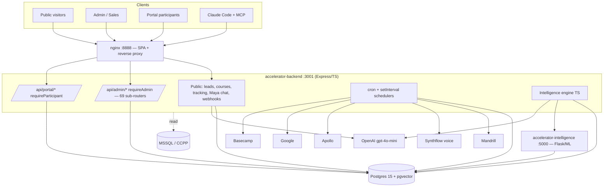
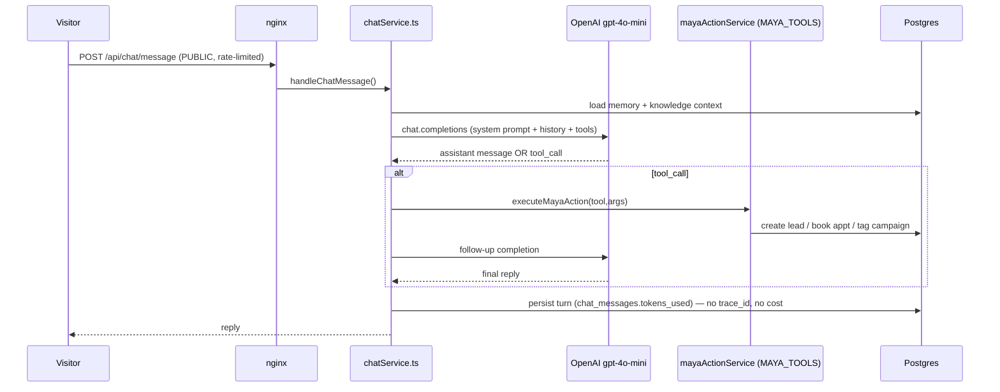

# Phase 1 — Repository Map

**Audit:** Trust Before Intelligence (TBI) compliance · **Repo:** `accel-repo` · **Date:** 2026-06-20
**Method:** Static code inspection. Every claim cites `file:line`. "NOT FOUND" means absence was verified and is itself a finding.

> **One-line architecture.** An npm-workspace monorepo — Express/TypeScript backend (`backend/`) + React 18 CRA frontend (`frontend/`) baked into an nginx image — plus a separate Python Flask intelligence engine (`intelligence/ai_engine`). Postgres 15 + pgvector is the only live datastore. The sole LLM provider is **OpenAI** (`gpt-4o-mini` default). There is **no message queue, no metrics backend, and no CI pipeline**.

---

## 1. System inventory (applications)

| App | Stack | Entry point | Start |
|---|---|---|---|
| **backend** | Node 20 · Express 4 · TypeScript · Sequelize | `backend/src/server.ts:33` (`express()`), `start()` `server.ts:492`, invoked `:660` | dev `ts-node-dev` (`backend/package.json:6`); prod `node dist/server.js` (`:8`); `backend/Dockerfile:36` |
| **frontend** | React 18 · CRA · Bootstrap 5 · react-router 6 · recharts | `frontend/src/index.tsx` → `src/App.tsx` | `react-scripts` (`frontend/package.json:6-7`); built bundle baked into nginx image |
| **intelligence (Python)** | Python 3.12 · Flask 3 · gunicorn · scikit-learn/xgboost/shap/hdbscan · pgvector | `intelligence/ai_engine/app.py:12` (`create_app()`) | `gunicorn ai_engine.app:app` (port 5000) |
| **gov-bid-builds/** (4 demo sub-apps) | own `package.json`s | n/a | not wired into main compose |

Backend → external app URLs: `intelligenceEngineUrl` (`backend/src/config/env.ts:76`, default `http://localhost:5000`), `aiProjectArchitectUrl` (`env.ts:79`, default `:8000`).

## 2. Service inventory (`backend/src/services` — 262 top-level `.ts` files)

| Domain | Location | Scale |
|---|---|---|
| Admissions / Maya chat | `services/agents/admissions/` + `services/chatService.ts:15-19` | 24 agents |
| Curriculum / content | `services/curriculum*`, `services/agents/curriculum*Agent.ts` | ~11 |
| Intelligence / agents | `services/agents/` + `services/agents/departments/` + `backend/src/intelligence/` (~30 subdirs) | 34 + 33 + engine tree |
| Marketing / OpenClaw outreach | `services/agents/openclaw/` (35), `services/agents/skool/` (7), `services/campaign*` (17) | ~59 |
| Sales / leads | `services/lead*`, `services/apolloService.ts`, `services/synthflowService.ts` | ~10 |
| Inbox (Chief-of-Staff) | `services/inbox/` | 21 |
| Ops (AI Ops Command Center) | `services/ops/` | 8 |
| Cory (exec) | `services/cory/`, `executiveBriefingService.ts` | ~6 |

## 3. Agent inventory

- Runtime registry: `backend/src/intelligence/agents/agentRegistry.ts` (+ `agentRegistrySeed.ts`, and an `-Ali-AI` variant — see §Anomalies).
- Agent execution wrapper: `backend/src/services/agentExecutionWrapper.ts` — **enriches input/output in memory only, persists nothing** (`:95-110`).
- Agent write governance: `backend/src/services/agentPermissionService.ts:342` writes `AgentWriteAudit` (only when a write routes through it).
- Documented catalog: `docs/agent-catalog/` (admissions, intelligence, departments, openclaw, super-agents — 135+ definitions).
- Action-taking agents of note: `services/agents/openclaw/openclawQualityGateAgent.ts`, `openclawPlatformPostingService.ts`, `services/agents/admissions/admissionsSynthflowCallAgent.ts`, `services/cory/coryBrain.ts`.

## 4. Data inventory

- **Postgres** via Sequelize — connection `backend/src/config/database.ts:4` (pool max 20), URL `env.databaseUrl` (`env.ts:9`). **225 model files** in `backend/src/models/`, registered via `import './models'` (`server.ts:31`).
- **pgvector** — prod image `pgvector/pgvector:pg15` (`docker-compose.production.yml:5`); extension created at boot `backend/src/intelligence/index.ts:51` (`CREATE EXTENSION IF NOT EXISTS vector`). RAG store `intelligence_memory` via `backend/src/intelligence/memory/vectorMemory.ts:42`.
- **MSSQL (read, secondary)** — `mssql` driver (`backend/package.json:37`), `env.ts:82-86` (default DB `CCPP`, alumni source).
- **No migration tool** — schema applied at boot via `sequelize.sync({ alter:true })` (`server.ts:531`) + hand-rolled `CREATE TABLE IF NOT EXISTS` (`server.ts:115,279,364,408`). Seeds in `backend/src/seeds/`.
- **Redis** — `ioredis` present but federation-only/lazy (`intelligence/systemStateEngine/distributedRuntime/redisBrokerAdapter.ts:88`); **no Redis service in any compose file** → dormant in prod.
- **Object storage** — none external; local disk volumes (`uploads`, `screenshots`, `browser_profiles`) in `docker-compose.production.yml:53-55,80-83`.

AI-relevant tables (see [event-model.md](event-model.md) for full schema): `chat_conversations`, `chat_messages`, `content_generation_logs`, `ai_agent_activity_logs`, `agent_write_audits`, `intelligence_decisions`, `ai_system_events`, `event_ledger`, `intent_scores`, `behavioral_signals`, `visitor_sessions`, `build_manifests`, `audit_logs`.

## 5. Workflow inventory

- **API surface** (registered `server.ts:54-64`; webhooks first `:42`):

| Group | File | Base path | Auth |
|---|---|---|---|
| Health | `routes/healthRoutes.ts:7,18` | `/health`, `/health/full` | PUBLIC |
| Leads | `routes/leadRoutes.ts:28-30` | `/api/leads`, `/api/leads/ingest` | PUBLIC (rate-limited) |
| External CRM | `routes/v1Routes.ts:17` | `/api/v1/leads` | service token |
| Enrollment | `routes/enrollmentRoutes.ts:11-14` | `/api/cohorts`, `/api/courses`, `/api/create-invoice` | PUBLIC |
| Tracking + **Maya chat** | `routes/trackingRoutes.ts:45-72` | `/api/t/*`, `/api/chat/*` | PUBLIC (rate-limited) |
| Webhooks | `routes/webhookRoutes.ts:13-34` | `/api/webhook/{paysimple,mandrill,ghl,synthflow,apollo}` | PUBLIC (sig in controller) |
| Portal | `routes/participantRoutes.ts:33-40` | `/api/portal/*` | mixed (`requireParticipant`) |
| Admin | `routes/adminRoutes.ts:73-138` | `/api/admin/*` (69 sub-routers) | `requireAdmin` **per-route** (see security finding) |

- **Async pattern:** in-process `node-cron` + `setInterval`; DB tables as work queues (`raw_lead_payloads` `server.ts:328`, `ops_approval_queue` `server.ts:168`). **No EventEmitter/event bus** (`grep` NOT FOUND).
- **Scheduled jobs** (4 systems): inline in `server.ts:571-644` (discovery `*/10`, ops rollup `*/5`, BC sync+priority+rules `*/2`, architect poll `*/2`); `schedulerService.ts:1632` (~30 schedules, gated by `enableFollowUpScheduler`); `aiOpsScheduler.ts:420` (DB-driven cron `cron_schedule_configs`); `inbox/inboxScheduler.ts:25` (sync 1m, classify 65s, digest 4h). PMO daily email is an OS-cron script `backend/src/scripts/runLaunchPmoDailyUpdate.js`.

## 6. Dependency inventory (external integrations)

| Integration | Client (file:line) | Env vars |
|---|---|---|
| **OpenAI** (LLM + embeddings) | `intelligence/assistant/openaiHelper.ts:10-12`; `chatService.ts:28`; Python `requirements.txt:11` | `OPENAI_API_KEY`, `AI_MODEL`, `CHAT_MODEL`, `EMBEDDING_MODEL` |
| **Synthflow** (voice) | `services/synthflowService.ts:102` | `SYNTHFLOW_API_KEY`, `SYNTHFLOW_*_AGENT_ID` |
| **Apollo** (enrichment) | `services/apolloService.ts:6,81` | `APOLLO_API_KEY` |
| **Mandrill** (email) | `services/emailService.ts:7-14` | `MANDRILL_API_KEY`, `MANDRILL_WEBHOOK_KEY` |
| **Google** (Calendar + Gmail/IMAP) | `services/calendarService.ts`, `inbox/inboxSyncService.ts` | `GOOGLE_*` |
| **Basecamp** (AI Ops) | `services/ops/basecampClient.ts:7` | `BASECAMP_ACCESS_TOKEN`, `BASECAMP_ACCOUNT_ID` |
| **PaySimple / GHL** | webhook controllers | `PAYSIMPLE_*` |
| **MSSQL/CCPP** | `mssql` | `MSSQL_*` |

**MCP servers** (`backend/src/mcp/`, stdio, SDK 1.29.0): `portalApiServer.js:26` (read-only state/telemetry tools `:11-16`), `postgresAnalyticsServer.js:30` (read-only prod psql over SSH, hard `FORBIDDEN_KEYWORDS` guard `:41-48`).

## 7. Security boundaries

- Middleware: `middlewares/authMiddleware.ts` — `requireAdmin` (`:22`, JWT + role∈{admin,super_admin}), `requireCoryAuthorized` (`:86`, hardcoded `email==='ali@colaberry.com'`); `participantAuth.ts`; `serviceAuthMiddleware.ts` (`requireServiceToken`); `rbacMiddleware.ts` (scaffolded, **largely unapplied**).
- App hardening: `helmet()`+`cors()` (`server.ts:38-39`), rate limits on public routers, 5 MB body cap (`:49`), nginx security headers (`nginx/nginx.conf:9-12`).
- **CRITICAL boundary defect:** `routes/adminRoutes.ts:72` applies only `auditMiddleware` router-wide — auth is **per-line**, and **15 admin sub-router files carry zero auth** (incl. OpenClaw posting + `production-activate`). Full evidence in [governance-audit.md](governance-audit.md) §5.

## 8. Deployment / infra

- Dockerfiles: `backend/Dockerfile` (node:20 + Playwright/Chromium + docker CLI), `intelligence/ai_engine/Dockerfile` (python:3.12 + gunicorn), `nginx/Dockerfile`.
- Compose: `docker-compose.production.yml` (postgres pgvector, backend:3001, intelligence:5000, nginx `8888:80`). Frontend baked into nginx (`nginx/nginx.conf:149` SPA fallback).
- VPS deploy: `ssh root@<host>` → `/opt/colaberry-accelerator` → `git pull && docker compose ... up -d --build` (root `CLAUDE.md`).
- **CI: NOT FOUND** — `.github/` has only `CODEOWNERS`; no Actions workflow.
- ⚠️ Preview stack mounts the host Docker socket (`docker-compose.production.yml:60`, comment "effective root on the host").

## Architecture diagrams

### (a) System context

### (b) Representative AI workflow — Maya public chat (OpenAI tool-calling)

## Anomalies / evidence gaps

1. **`-Ali-AI` duplicate files** (`openclawRoutes-Ali-AI.ts`, `aiOrchestrator-Ali-AI.ts`, `aiOpsScheduler-Ali-AI.ts`, `agentRegistrySeed-Ali-AI.ts`) shadow canonical files; the canonical ones are mounted — duplicates' wiring unresolved (dead code risk).
2. `aiOpsScheduler` cadence is **data-driven** (`cron_schedule_configs`) — live schedule not in source.
3. PMO daily-email cron lives in **VPS crontab**, not in-repo.
4. `backend/src/intelligence/` (~30 subdirs) catalogued at directory/entry-point level, not file-by-file.
5. Runtime DB contents not inspected (static audit only).
